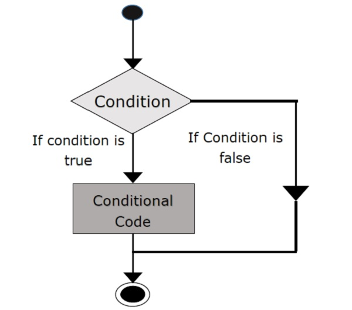

name: inverse
layout: true
class: center, middle, inverse
---
name: Inicio
#Curso de R y estadística básica
[Felipe de J. Muñoz González]

[fmunoz@lcg.unam.mx](mailto:fmunoz@lcg.unam.mx)
.footnote[Introducción<br>[Descargar Presentación](http://pipemg.github.io/CursoR_INMEGEN/Presentacion2.pdf)]

---
layout: false

.left-column[
  ## Archivos
  ### - Ver archivos, obtener el directorio y cambiar de directorio

]

.right-column[
 
Escritura y lectura de archivos en R


Supongamos que tenemos un fichero denominado [lista_de_datos.txt](lista_de_datos.txt)  y que lo queremos leer utilizando scan(file=" ", what = numeric(), n, sep, ...)


```
 datos = scan("lista_de_datos.txt",sep=",")
```
 
Para leer tablas directamente en R tenemos diversas funciones como read.table()

```
 datos = read.table("edadaltura.csv", sep=",")
 colnames(datos)
 rownames(datos)
 ?read.table

```
 
```
 ?read.csv

```
]

---
layout: false
.left-column[
  ## Archivos
  ### - Ver archivos, obtener el directorio y cambiar de directorio

]

.right-column[
 
Escritura y lectura de archivos en R

Para el caso análogo de escritura utilizamos la función write.table

```
 ?write.table
```
 
guardemos la tabla de datos en el archivo datos1

```
 write.table(datos, "datos1.csv")
 write.table(datos, "datos2.tsv", sep="\t")
 write.table(datos, "datos3.tsv", sep="\t", quote=T)
```

adicional a la función write.table, tenemos la función write para vectores.

```
 x<-seq_len(1:100)
 write(x, file="seq_numerica.txt")
```

 
]

---
name: last-page
template: inverse

## Datos y gráficas básicas en R

---

layout: false
.left-column[
  ## ¿Tipos de Datos?
]
.right-column[

**_datum_** se refiere a la información concreta, cualquier pieza de información colectada.

Un **"Data set"** o set de datos es una colección de datos relacionadas de alguna forma.

Se definen 5 tipos de datos:

 - Cuantitativos

 - Cualitativos

 - Logicos

 - Faltantes


]
---

layout: false
.left-column[
  ## ¿Tipos de Datos?
   ###  - Datos cuantitativos
]
.right-column[

Son datos que se pueden medir o son asociados a alguna cantidad. 

Se subdividen en:

 - Datos discretos

 - Datos continuos (datos escalares o de intervalos)


**Nota** Cuando no se sabe que tipo de dato cuantitativo es, considerese continuo

]

---

layout: false
.left-column[
  ## ¿Tipos de Datos?
   ### - Datos cuantitativos (Ejemplo)
]
.right-column[
<br>
Ejemplo Precipitaciones anuales en ciudades de EE.UU. El vector contiene la cantidad promedio de lluvia (en pulgadas) para cada una de las 70 ciudades de los Estados Unidos.

```
 str(precip)
```

```
 precip[1:4]
```

**Ejercicio**

Describir los datos dentro de los dataset "rivers" y "discoveries"

]


---

layout: false
.left-column[
  ## ¿Tipos de Datos?
   ### - Datos cuantitativos 
   ### - Gráficas de puntos
]
.right-column[

Una de las cosas básicas que debe de manejarse cuando se describen los datos son gráficas que nos permitan tener mas información.


 1. Graficas de puntos (Strip charts). Existen 3 metodos:
   - <b>overplot</b>: <br>Diagrama de dispersión unidimensional
   - <b>jitter</b>: <br>Diagrama de dispersion bidimencional (quita superposiciones)
   - <b>stack</b>: <br>Diagrama de puntos apilados por su

```
str(airquality)

stripchart(airquality$Ozone, xlab = "Ozono") 
```

Podemos ver que la mayoría de los datos están llenos por debajo de 50 con uno fuera de 150.

Podemos pasar parámetros adicionales para controlar el aspecto de la grafica. Puedes leer sobre ellos en la sección de ayuda. ?stripchart

]

---

layout: false
.left-column[
  ## ¿Tipos de Datos?
   ### - Datos cuantitativos 
   ### - Gráficas de puntos
]

.right-column[

Generamos una gráfica de puntos agregeando un ruido aleatorio para separar las muestras sobrelapadas

```
stripchart(airquality$Ozone,
main="Mean ozone in parts per billion at Roosevelt Island",
xlab="Parts Per Billion",
ylab="Ozone", method="jitter",
col="orange", pch=1)
```

Consideremos el campo de temperatura del conjunto de datos de calidad del aire. También generemos una distribución normal con la misma media y desviación estándar y tráigalos lado a lado para la comparación.


```
# Preparación de la información
temp <- airquality$Temp
# Generar una distribución normal
tempNorm <- rnorm(200,mean=mean(temp, na.rm=TRUE), sd = sd(temp, na.rm=TRUE))
# Generar una lista
x <- list('temp'=temp, 'norm'=tempNorm)
```


]

---

layout: false
.left-column[
  ## ¿Tipos de Datos?
   ### - Datos cuantitativos 
   ### - Gráficas de puntos
]
.right-column[


```
stripchart(x, main="Multiple stripchart for comparision",
xlab="Degree Fahrenheit",
ylab="Temperature", method="jitter",
col=c("orange","red"), pch=16)
```

```
stripchart(discoveries, method = "stack", xlab = "number")
```

]


---

layout: false
.left-column[
  ## ¿Tipos de Datos?
   ### - Datos cuantitativos 
   ### - Gráficas de puntos
]
.right-column[

La función stripchart() también puede tomar fórmulas de la forma y ~ x donde, y es un vector numérico que se agrupa de acuerdo con el valor de x.

```
stripchart(Temp~Month,
data=airquality,
main="Different strip chart for each month",
xlab="Months",
ylab="Temperature",
col="brown3",
group.names=c("May","June","July","August","September"),
vertical=TRUE,
pch=16
)
```


**Ejercicio** 
 - Comparar las diferentes gráficas y definir sus diferencias con un solo dataset


```
demo("graphics")

```

]


---

layout: false
.left-column[
  ## ¿Tipos de Datos?
   ### - Datos cuantitativos 
   ### - Histogramas
]
.right-column[
<br>


 1. Histogramas (Bar Graphs)

Normalmente se usan para datos continuos y se requiere decidir un conjunto de clases o compartimientos que dividen la linea real en un conjunto de cajas a los cuales caen los valores.

```
 hist(precip, main = "Histograma de lluvias en U.S.A")
```
<br>
```
 hist(precip, freq = FALSE, main = "") #Frecuencias Relativas
```

<br>
Consideraciones:
 - La gráfica depende de los "bins" elegidos
]

---

layout: false
.left-column[
  ## ¿Tipos de Datos?
   ### - Datos cuantitativos 
   ### - Histogramas
]
.right-column[


**Ejercicio** 
 - Jugar con el valor de ~breaks~ dentro de histograma
 - probar las diferentes opciones de ~labels~,~freq~, ~col~, ~main, xlab, ylab, xlim, ylim~ y ~labels~.
<br>
 *Revisar el manual*
<br>
 - Genera dos histogramas de los datos de precipitación, el primero con 10 divisiónes y el segundo con 200
]


---

layout: false
.left-column[
  ## ¿Tipos de Datos?
   ### - Datos cuantitativos 
   ### - Gráficas de tallo
]
.right-column[


**Definición**

Las Gráficas de tallo tienen dos partes básicas: tallos y hojas.
El último dígito de los valores de datos se toma como una hoja y el (los) dígito (s) principal (es) se toma (n) como tallos. Permite obtener simultáneamente una distribución de frecuencias de la variable y su representación gráfica. 


**Ejemplo**
UKDriverDeaths serie de datos en el tiempo que contiene las muertes en accidentes automovilisticos o con lesiones fuertes en Reino Unido de Enero de 1969 a Diciembre de 1984. ?UKDriverDeaths.

```
install.packages("aplpack", dependencies=T)

library(aplpack)

stem.leaf(UKDriverDeaths, depth = FALSE)

```


]


---

layout: false
.left-column[
  ## ¿Tipos de Datos?
   ### - Datos cuantitativos 
   ### - Gráficas de Índice
]
.right-column[


Estas se realizan utilizando la función **plot** y son buenas para visualizar datos que han sido ordenados, cuando los datos fueron medidos a traves del tiempo.

Es una gráfica de dos dimensiones que tiene una variable índice (x) y una variable medida (y). 

Existen los siguientes métodos:

 - picos (spikes).  code: (type = "h")

 - puntos (points) code: (type = "p"=)


**Ejemplo**
Mediciones anuales (En pies) del lago Huron de 1875-1972. Los datos son en el tiempo. ?LakeHuron


```
 plot(LakeHuron, type = "h")

```

```
 plot(LakeHuron, type = "p")
```
]


---

layout: false
.left-column[
  ## ¿Tipos de Datos?
   ### - Datos cuantitativos 
   ### - Gráficas de Índice
]
.right-column[
La función de graficación más utilizada en la programación de R es la función plot(). Es una función genérica, es decir, tiene muchos métodos que se llaman según el tipo de objeto pasado a plot().


```
x <- seq(-pi,pi,0.1)
plot(x, sin(x))
```

```
plot(x, sin(x),
main="Overlaying Graphs",
ylab="",
type="l",
col="blue")
lines(x,cos(x), col="red")
legend("topleft",
c("sin(x)","cos(x)"),
fill=c("blue","red")
)
```

]

---

layout: false
.left-column[
  ## ¿Tipos de Datos?
   ### - Datos cuantitativos 
   ### - Gráficas de Índice
]
.right-column[

**Ejercicio**

- Utilizar diferentes tipos de gráficas de plot, definir nombres de los ejes y la proporcion de los ejes x/y
- utilizar la función abline con la opcion lty para trazar una linea horizontal punteada que divida el 15% de las muestras menores y una linea vertical que divida antes y despúes del año de inicio de la primera guerra mundial (tip. 1914).

]


---

layout: false
.left-column[
  ## ¿Tipos de Datos?
   ### - Datos cualitativos
]
.right-column[

Datos **no numericos** o que no representan cantidades numericas.

Ej. Nombre, genero, grupo etnico, estado socioeconomico, numero de seguridad social, licencia, ...

Algunos datos parecen ser cuantitativos pero no lo son por que no representan cantidades numericas medibles ni conservan reglas matemáticas.

Ej. Tamaño del pie de una persona (si sumas el tamaño del pie de dos personas no tiene sentido)

La información cuantitativa que se puede utilizar para subdividir información en diversas categorias se le llama **factor** .

]

---

layout: false
.left-column[
  ## ¿Tipos de Datos?
   ### - Datos cualitativos
   ### - Presentación de Datos
]
.right-column[
**Factores** 
Un factor es un vector que se usa para especificar una clasificación discreta de los componentes de
otros vectores de la misma longitud.


```
 estudiantes.origen = c("Sonora","Nuevo Leon","CDMX","CDMX","Nuevo Leon",
"Yucatan","Sonora","Yucatan","CDMX","Nuevo Leon","Durango","Jalisco","Nuevo Leon",
"Sonora","Yucatan")
 estudiantes.origen
 length(estudiantes.origen)

```
Ahora creamos una variable de tipo factor, a partir de la existente:


```
 festudiantes = as.factor(estudiantes.origen)
 festudiantes
 levels(festudiantes)
 summary(festudiantes)

```

Supongamos ahora que disponemos de las estaturas de cada uno de los estudiantes del ejemplo
anterior y vamos a calcular la estatura promedio

```
 estudiantes.estaturas = c(1.83, 1.71, 1.79, 1.64, 1.74, 1.81, 1.62, 1.84, 1.68, 1.81, 1.82, 1.74, 1.84, 1.61, 1.84)
 tapply(estudiantes.estaturas,festudiantes,mean)

```

]

---

layout: false
.left-column[
  ## ¿Tipos de Datos?
   ### - Datos cualitativos
   ### - Presentación de Datos
]
.right-column[
**Factores ordenados** 
Son factores cuyos niveles guardan un determinado orden. Para crear un factor ordenado o
para transformar un factor en ordenado se usa la función ordered().

Supongamos que tenemos un vector con el nivel de inglés de 10 estudiantes:


```
 nivel.ingles = c("medio", "medio", "bajo",  "medio", "bajo",  "medio", "alto",  "alto",  "bajo", "bajo" )
 nivel.ingles


```
Ahora creamos un factor ordenado con el nivel de inglés de los estudiantes:

```
 fnivel.ingles = ordered(nivel.ingles,levels=c("bajo","medio","alto"))
 fnivel.ingles

```

Si ahora queremos saber qué estudiantes tienen un nivel de inglés por debajo de "medio":


```
 fnivel.ingles<"medio"

```

]
---

layout: false
.left-column[
  ## ¿Tipos de Datos?
   ### - Datos cualitativos
   ### - Presentación de Datos
]
.right-column[

**Tablas** 
Una forma de mostrar resumenes de datos estadisticos es con el uso de las tablas. 

state.XXXX Data sets related to the 50 states of the United States of America.


```
 str(state.abb)
```

Frecuencias absolutas

```
 Tbl <- table(state.division)
 Tbl
```

Frecuencias Relativas

```
 Tbl/sum(Tbl)
```

```
 Tbl/sum(Tbl)
```

]


---

layout: false
.left-column[
  ## ¿Tipos de Datos?
   ### - Datos cualitativos
   ### - Descripción
]
.right-column[


Los datos de state.region enumera cada uno de los 50 estados y la región a la que pertenece, ya sea en el noreste, sur, norte central u oeste.

```
 str(state.region)
```

```
 state.region[1:5]
```

```
 str(state.abb)
```

Frecuencias absolutas

```
 Tbl <- table(state.division)
 Tbl
```

Frecuencias Relativas

```
 Tbl/sum(Tbl)
```

```
 prop.table(Tbl) # same thing
```

]

---


layout: false
.left-column[
  ## ¿Tipos de Datos?
   ### - Datos cualitativos
   ### - Gráficas de Barras
]
.right-column[


Un gráfico de barras es el análogo de un histograma para datos categóricos. Se muestra una barra
Para cada nivel de un factor, con las alturas de las barras proporcionales a las frecuencias de observaciones
Pertenecientes a las respectivas categorías. Una desventaja de los gráficos de barras es que los niveles están ordenados alfabéticamente (por defecto), lo que a veces puede oscurecer los patrones en la pantalla.

```
 barplot(table(state.region), cex.names = 0.5)
```

```
 barplot(prop.table(table(state.region)), cex.names = 0.5)
```

]


---


layout: false
.left-column[
  ## ¿Tipos de Datos?
   ### - Datos cualitativos
   ### - Diagramas de Pareto
]
.right-column[


Un diagrama pareto es muy parecido a un gráfico de barras excepto que las barras se reordenan de tal manera que disminuyen en altura, pasando de izquierda a derecha. La reorganización es útil porque puede revelar visualmente la estructura (si es que hay) en la velocidad de las barras disminuyen - esto es mucho más difícil cuando las barras se mezclan.

```
 install.packages("qcc")
```

```
 library(qcc)
```

```
 pareto.chart(table(state.division), ylab = "Frequency")
```
**Ejercicio** cambia los colores de la gráfica de pareto, utilizando alguna de las paletas de colores.
```
 install.packages("RColorBrewer")
 library(RColorBrewer)
 display.brewer.all()
```

]


---

layout: false
.left-column[
  ## ¿Tipos de Datos?
   ### - Datos cualitativos
   ### - Gráfica de puntos
]
.right-column[


Estos se parecen mucho a un gráfico de barras que se ha girado en su lado con las barras reemplazadas por puntos en líneas horizontales. No transmiten más (o menos) información que el gráfico de barras asociado, pero la fuerza reside en la economía de la pantalla. Los gráficos de puntos son tan compactos que es fácil graficar interacciones multi-variables muy complicadas en un gráfico.

```
x <- table(state.region)
```

```
 dotchart(as.vector(x), labels = names(x))
```
]


---
layout: false

.left-column[
  ## ¿Tipos de Datos?
   ### - Datos cualitativos
   ### - Gráfica de pastel
]
.right-column[


"These can be done with R but they fallen out of favor in recent years because researchers have determined that while the human eye is good at judging linear measures, it is notoriously bad at judging relative areas."  - Introduction to probability using R.

```
 slices <- c(10, 12,4, 16, 8)
 lbls <- c("US", "UK", "Australia", "Germany", "France")

```

```
 pie(slices, labels = lbls, main="Pie Chart of Countries"
```
]

---
name: last-page
template: inverse

## Matrices, Factores en R y DataFrames

---


layout: false
.left-column[
  ## Datos multivariados
   ### Introducción
]
.right-column[
 
Los estudios estadísticos requieren mas de un factor o medición asociado a cada objeto, para esto utilizamos otra **estructura de datos**.

Para esto existen dos tipos de estructuras en R:

 - Matrices
 - DataFrames

Ambas son estructuras arreglas en dos dimensiones en forma rectangular y estaremos considerando que (a menos que se indique lo contrario):

  - Las lineas son objetos
  - Las columnas contienen diferentes mediciones o factores

Ejemplo:

```
 x <- 5:8
 y <- letters[3:6]
 z <- 1:4*pi
 A <- data.frame(v1 = x, v2 = y, v3=z)
```
]

---


layout: false
.left-column[
  ## Datos multivariados
   ### Matrices
]
.right-column[

```
 A = matrix( 
+   c(2, 4, 3, 1, 5, 7), # the data elements 
+   nrow=2,              # number of rows 
+   ncol=3,              # number of columns 
+   byrow = TRUE)        # fill matrix by rows 
 
 A                      # print the matrix 

```

```
 A = matrix( 
+   c(2, 4, 3, 1, 5, 7), # the data elements 
+   nrow=2,              # number of rows 
+   ncol=3,              # number of columns 
+   byrow = TRUE)        # fill matrix by rows 
 
 A                      # print the matrix 

```

```
 dimnames(A) = list( 
+   c("row1", "row2"),         # row names 
+   c("col1", "col2", "col3")) # column names
``` 

```
 rownames(x) <- c("row1", "row2")
 colnames(x) <- c("C1","C2","C3")
``` 
]


---
layout: false
.left-column[
  ## Datos multivariados
   ### Matrices
]
.right-column[

```
 A<-cbind(c(1,2,3),c(4,5,6))
[,1] [,2]
[1,]    1    4
[2,]    2    5
[3,]    3    6
 B<-rbind(c(1,2,3),c(4,5,6))
[,1] [,2] [,3]
[1,]    1    2    3
[2,]    4    5    6


 x[c(1,2),c(2,3)]    # select rows 1 & 2 and columns 2 & 3
 x[-1,]    # select all rows except first
 x[c(3,2),]
```
]

---
layout: false
.left-column[
  ## Datos multivariados
   ### Acceso a DataFrames
]
.right-column[

```
 A[3, ]
 A[1, ]
```

```
 A[, 2]
 names(A)
 A$v1
```

]

---
layout: false
.left-column[
  ## Datos multivariados
   ### Modificar un DataFrame
]
.right-column[
<br>

```
 A <- data.frame(SN = c(1,2), Age = c(21,15), Name=c("John","Dora"))
```

```
  A[1,"Age"] <- 20; x
```

Agregar nuevos elementos
```
 rbind(A,list(1,16,"Paul"))
```
```
 cbind(A,State=c("NY","FL"))
```

Eliminar un elemento
```
 A$State <- NULL
```

DataFrames vs Matrices:

Las **Matrices** son solamente arreglos numericos de dos dimensiones mientras que los **DataFrame** contienen diferentes tipos de valores


]
---
name: last-page
template: inverse

## Estructuras de Control 

---
layout: false
.left-column[
  ## Estructuras de Control 
   ### If
]
.right-column[


```
  if (test_expression) {
	statement
  }
```




Si test_expression es TRUE, la instrucción se ejecuta. Pero si es FALSO, no pasa nada.


**Ejercicio** Crea un if que evalue si X es positivo 


]
---
layout: false
.left-column[
  ## Estructuras de Control 
   ### If else
]
.right-column[

```
 if (test_expression) {
+   statement1
+ } else {
+   statement2
+ }
```


Si test_expression es TRUE, la instrucción 1 se ejecuta. Pero si es FALSO se ejecuta la instrucción 2


**Ejercicio** Crea un if,else que evalue si X es positivo o negativo

Cascada if..else

```
 if ( test_expression1) {
+	statement1
+ } else if ( test_expression2) {
+	statement2
+ } else if ( test_expression3) {
+	statement3
+ } else {
+	statement4
+ }
```

]
---
layout: false
.left-column[
  ## Estructuras de Control 
   ### ifelse
]
.right-column[
<br> 

```
ifelse(test_expression, x, y)
```
**Ejercicio** Crea un ifelse que evalue si X es par o no

```
 a = c(5,7,2,9)
 ifelse(a %% 2 == 0,"even","odd")
```

]
---
layout: false
.left-column[
  ## Estructuras de Control 
   ### For
]
.right-column[

<br> 


```
 for (val in sequence){
+   statement
+ }

```

Aquí, la secuencia es un vector y val toma cada uno de sus valores durante el ciclo. En cada iteración, se evalúa la declaración.


**Ejercicio**  contar el número de números pares en un vector.

]
---
layout: false
.left-column[
  ##  Estructuras de Control 
   ### R while Loop
]
.right-column[


```
 while (test_expression){
+	statement
+ }
```


Aquí, test_expression se evalúa y el cuerpo del loop se ingresa si el resultado es TRUE.

Las instrucciones dentro del ciclo se ejecutan y el flujo vuelve a evaluar test_expression nuevamente.

Esto se repite cada vez hasta que test_expression se evalúa como FALSE, en cuyo caso, el ciclo sale

]
---
layout: false
.left-column[
  ##  Estructuras de Control 
   ### R while Loop
]
.right-column[

```
 i <- 1
 while (i < 6) {
+	print(i)
+	i = i+1
+ }
```
]
---
layout: false
.left-column[
  ##  Estructuras de Control 
   ###  break and next 

]
.right-column[

<br><br>
Una instrucción break se usa dentro de un ciclo (repeat, for, while) para detener las iteraciones y hacer fluir el control fuera del ciclo.


```
 if (test_expression) {
+	break
+ }
```
Una siguiente declaración es útil cuando queremos omitir la iteración actual de un ciclo sin terminarlo. Al encontrar el siguiente, el analizador R omite una evaluación adicional y comienza la siguiente iteración del ciclo.

```
 if (test_condition) {
	next
 }
```

]
---
layout: false
.left-column[
  ##  Estructuras de Control 
   ### repeat
]
.right-column[

Un ciclo de repetición se usa para iterar sobre un bloque de código varias veces.

No hay verificación de condición en repetir bucle para salir del bucle.

Nosotros mismos debemos poner una condición explícitamente dentro del cuerpo del ciclo y usar la instrucción break para salir del ciclo. De lo contrario, se producirá un ciclo infinito.
```
 repeat {
+   statement
+   break 
 }
```

```
 x <- 1
 repeat {
+	print(x)
+	x = x+1
+	if (x == 6){
+ 		break
+ 	}
+ }
```
]


---
layout: false
.left-column[
  ##  Estructuras de Control 
   ### apply
]
.right-column[
 

Cuando usar apply.

Cuando tenemos una función para aplicar a una estructura de datos determinada. Donde estructura se puede definir como un tipo de matriz o lista. 

```
 m <- matrix(data=cbind(rnorm(30, 0), rnorm(30, 2), rnorm(30, 5)), nrow=30, ncol=3) 
```
Primero quiero asegurarme de haber creado correctamente la matriz, tres columnas cada una con una media de 0, 2 y 5 respectivamente. 

```
 apply(m, 1, mean)
```

Al pasar un 1 en el segundo argumento, recuperamos 30 valores, dando la media de cada fila. No son los tres números que esperábamos, intente de nuevo.
```
apply(m, 2, mean)
```
]

---
layout: false
.left-column[
  ##  Estructuras de Control 
   ### apply
]
.right-column[
 
<br><br>
Utilizar tus propias funciones

```
 mifuncion<-function(x){
	length(x[x<0])
 }

 apply(m, 2, FUN=mifuncion)
```

```
 apply(m, 2, function(x) length(x[x<0]))

```

```
 apply(m, 2, function(x) is.matrix(x))
 apply(m, 2, is.matrix)
 apply(m, 2, is.vector)
```

]

---
layout: false
.left-column[
  ##  Estructuras de Control 
   ### sapply and lapply
]
.right-column[
 <br><br>

Estas dos funciones funcionan de manera similar, atraviesan un conjunto de datos como una lista o un vector y llaman a la función especificada para cada elemento.


```
 sapply(1:3, function(x) x^2)


 lapply(1:3, function(x) x^2)

```

Utilizando la opcion simplify = F, saplly te da una lista
```
 sapply(1:3, function(x) x^2, simplify=F)
 ?unlist
 ?tapply
 ?
```
]
---


name: last-page
template: inverse

## That's all folks (for now)!

Slideshow created using [remark](http://github.com/gnab/remark).
