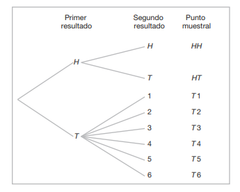
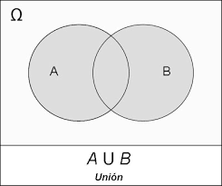
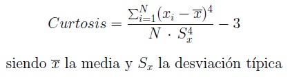

name: inverse
layout: true
class: center, middle, inverse
---
name: Inicio
#Curso de R y estadística básica
[Felipe de J. Muñoz González]

[fmunoz@lcg.unam.mx](mailto:fmunoz@lcg.unam.mx)
.footnote[Introducción<br>[Descargar Presentación](http://pipemg.github.io/CursoR_INMEGEN/Presentacion3.pdf)]

---

name: last-page
template: inverse

## Probabilidad
---

layout: false
.left-column[
  ## Fundamentos de probabilidad
   ### Espacio muestral
]
.right-column[

**Espacio muestral**  (denotado S) consiste en el conjunto de todos los posibles resultados de un experimento aleatorio.

**Punto muestral** (Elemento/miembro) es un resultado del espacio muestral

Moneda 

```
coin<-data.frame(pos=c("H","T"))

```

Espacio Muestral de una moneda que se lanza 3 veces

```{r}
Scoin<-expand.grid(tiro1=c("H","T"),tiro2=t(coin),tiro3=t(coin))
Scoin[sample(1:nrow(Scoin),1),] # Un experimento aleatorio
sample(x=c("H","T"), size=5, replace=T) # Un experimento aleatorio de tirar 5 monedas
```

Dado

```
dice<-data.frame(pos=c(1:6))
Sdice<-expand.grid(t(dice),t(dice),t(dice))
Sdice[sample(1:nrow(Sdice),1),]

```


]
---

layout: false
.left-column[
  ## Fundamentos de probabilidad
   ### Diagrama de arbol
]
.right-column[



Ej. Un experimento consiste en lanzar una moneda y después lanzarla una segunda vez si sale
cara. Si en el primer lanzamiento sale cruz, entonces se lanza un dado una vez.
```
S<-c("HH","HT", "T1", "T2", "T3", "T4", "T5", "T6")

```


]

---
layout: false
.left-column[
  ## Probabilidad
   ### Espacio muestral
]
.right-column[
<br><br>
Espacio Muestral de Cartas Inglesas 

```
palos<-c("D","P","T","C")

numeros<-c(1:10,"J","Q","R")

cartas<-as.vector(outer(numeros, palos, paste, sep=""))

cartas<-sample(cartas)

Scartas<-sample(cartas,5,replace=F) #Obtener una mano


```

Espacio Muestral de Muestreo de urnas

```
urna=c("roja","azul","amarilla","violeta","negra","blanca")

```

```
urnsample<-sample(urna,size=20, replace=T)

table(urnsample)
```

]
---

layout: false
.left-column[
  ## Fundamentos de probabilidad
   ### Diagrama de árbol
]
.right-column[


Suponga que se seleccionan, de forma aleatoria, tres artículos de un proceso de fabricación.
Cada artículo se inspecciona y se clasifica como defectuoso, D, o no defectuoso, N

Espacio muestral
```
 S <- c("DDD", "DDN", "DND", "DNN", "NDD", "NDN", "NND", "NNN")

```
]
---

layout: false
.left-column[
  ## Fundamentos de probabilidad
   ### Diagrama de árbol
]
.right-column[

Los espacios muestrales con un número grande o infinito de puntos muestrales se
describen mejor mediante un enunciado o método de la regla.

S = {x | x es una ciudad con más de un millón de habitantes},

S = {(x, y) | x<sup>2</sup> + y<sup>2</sup> ≤ 4}.
]


---

layout: false
.left-column[
  ## Probabilidad
   ### Union, Interseccion y diferencia
]
.right-column[

**Evento** es un conjunto de puntos muestrales en los cuales estamos interesados, más que en la ocurrencia de un elemento específi co en el espacio muestral. Un evento es un subconjunto de un espacio muestral.

```
S <- expand.grid(numeros, palos)
colnames(S)<-c("numero", "palo")
A <- subset(S, palo == "C")
B <- subset(S, numero %in% as.character(7:9))
S<-apply(S,1,paste, collapse="")
A<-apply(A,1,paste, collapse="")
B<-apply(B,1,paste, collapse="")
```

Suponga que se seleccionan, de forma aleatoria, tres artículos de un proceso de fabricación.
Cada artículo se inspecciona y se clasifica como defectuoso, D, o no defectuoso, N.

Podríamos estar interesados en el evento B de que el número de artículos defectuosos sea mayor que 1.

B = {DDN, DND, NDD, DDD}

Es posible concebir que un evento puede ser un subconjunto que incluye todo el espacio muestral S, o un subconjunto de S que se denomina conjunto vacío y se denota con el símbolo ϕ.


]
---

layout: false
.left-column[
  ## Probabilidad
   ### Union 
]
.right-column[
<br>

La unión de dos eventos A y B, que se denota con el símbolo A ∪ B, es el evento que
contiene todos los elementos que pertenecen a A o a B, o a ambos.

```
union(A,B)

```


]
---

layout: false
.left-column[
  ## Probabilidad
   ### Complemento 
]
.right-column[
<br>

El complemento de un evento A respecto de S es el subconjunto de todos los elementos
de S que no están en A. Denotamos el complemento de A mediante el símbolo A'

```
setdiff(S,A)
```


**Nota** setdiff no es simetrico y podemos calcular el complemento de todos los eventos Ej. setdiff(S,A)
]

---

layout: false
.left-column[
  ## Probabilidad
   ### Interseccion y diferencia
]
.right-column[
<br>

La **intersección** de dos eventos A y B, que se denota con el símbolo A ∩ B, es el evento
que contiene todos los elementos que son comunes a A y a B.

```
intersect(A, B)
```


]


---
layout: false
.left-column[
  ## Programación
   ### Operadores lógicos y comparativos
]
.right-column[

Relaciónes
- **>** Mayor que
- **<** Menor que
- **<=** Menor o igual que
- **>=** Mayor o igual que
- **==** Igual 
- **!=** Diferente

Lógicos
- **!x** Negación (no x)
- **x & z** Conjución (x y z)
- **x && z** Conjunción(*)
- **x|y** Disyuncion
- **==** Disyuncion(*) 
- **xor(x, y)** O exclusivo (∗∗)
- **identical()** Comparar dos objetos

<small><small>
(∗) Si se escriben dos símbolos repetidos, estos tienen el mismo significado que si apareciese uno,  la diferencia consiste en que se evalúa primero la parte de la izquierda y, si ya se sabe el resultado no se sigue evaluando, por lo que pueden ser mas rapidos y eliminar errores

(∗∗) Da como valor verdadero si uno y sólo un argumento es válido.
</small></small>
]


---

layout: false
.left-column[
  ## Programación
   ### Operadores lógicos y comparativos
]
.right-column[
<br><br>
```
> x<-10; x # Asignamos a x el valor 10
> x<5 # Le preguntamos si x es menor que 5
> x>=5 # Le preguntamos si x es mayor o igual que 5
> x==5 # Le preguntamos si x vale 5
> x!=5 # Le preguntamos si x es distinto de 5
```

```
> y<-1:3; z<-3:1 # Creamos dos vectores
> identical(y,z) # Le preguntamos si son iguales
> y==z # Vemos los elementos que coinciden
> x<-1:5 # Renombramos x e y
> y<-c(2,4,3,6,5)
```

```
> x==y
> x!=y
> x[x==y]
> x[x!=y]

```
]


---
layout: false
.left-column[
  ## Probabilidad
   ### Subsets de datos en R
]
.right-column[

Subsets de datos en R

%in%  #busqueda por elementos

```
> x <- 1:10
> y <- 8:12
> y %in% x
> y[y %in% x]

```

isin 

```
> isin(x,y) #todo el vector

```

all 
```
> x <- 1:10
> y <- c(3, 3, 7)
> unique(c(y %in% x))


```

¿Por que isin y all tienen esos resultados?


]


---

layout: false
.left-column[
  ## Probabilidad
   ### Conteo de puntos muestrales
]
.right-column[
<br>

**Regla de multiplicación**
Si una operación se puede llevar a cabo en n1 formas, y si para cada una de éstas se puede realizar una segunda operación en n2 formas, entonces las dos operaciones se pueden ejecutar juntas de n1*n2 formas.

¿Cuántos puntos muestrales hay en el espacio muestral cuando se lanza un par de dados
una vez? 


**Solución:** El primer dado puede caer en cualquiera de n1 = 6 maneras. Para cada una de esas 6 maneras el segundo dado también puede caer en n2 = 6 formas. Por lo tanto, el par de dados puede caer en n1*n2 = (6)(6) = 36 formas posibles. 

]
---
layout: false
.left-column[
  ## Probabilidad
   ### Conteo de puntos muestrales
]
.right-column[
<br>

**regla de multiplicación generalizada**
Si una operación se puede ejecutar en n<sub>1</sub> formas, y si para cada una de éstas se puede llevar a cabo una segunda operación en n<sub>2</sub> formas, y para cada una de las primeras dos se puede realizar una tercera operación en n<sub>3</sub> formas, y así sucesivamente, entonces la serie de k operaciones se puede realizar en n<sub>1</sub>*n<sub>2</sub> * ... * n <sub>k</sub> formas. 

]
---
layout: false
.left-column[
  ## Probabilidad
   ### Conteo de puntos muestrales
]
.right-column[

Sam va a armar una computadora y para comprar las partes tiene que elegir entre las siguientes opciones: dos marcas de circuitos integrados, cuatro marcas de discos duros, tres marcas de memorias y cinco tiendas locales en las que puede adquirir un conjunto de accesorios. 

¿De cuántas formas diferentes puede Sam comprar las partes?

**Solución:** Como n<sub>1</sub> = 2, n<sub>2</sub> = 4, n<sub>3</sub> = 3 y n<sub>4</sub> = 5, hay n<sub>1</sub> × n<sub>2</sub> × n<sub>3</sub> × n<sub>4</sub> = 2 × 4 × 3 × 5 = 120

**Ejercicio:** ¿Cuántos números pares de cuatro dígitos se pueden formar con los dígitos 0, 1, 2, 5, 6
y 9, si cada dígito se puede usar sólo una vez?

]
---
layout: false
.left-column[
  ## Probabilidad
   ### Conteo de puntos muestrales
]
.right-column[
<br>

Una **permutación** es un arreglo de todo o parte de un conjunto de objetos.Una permutación es un arreglo de todo o parte de un conjunto de objetos.

Considere las tres letras a, b y c y las permutaciones posibles con las 3 letras

S = {"abc", "acb", "bac", "bca","cab", "cba"}


Aqui vemos que tenemos 3 opciones para la primera letra, 2 opciones para la segunda y automáticamente la tercera queda determinada. 


Para cualquier entero no negativo n, n!, denominado **"n factorial"** se define como N! = n(n – 1) ··· (2)(1), con el caso especial de 0! = 1.

El número de **permutaciones** de n objetos es n!

]
---
layout: false
.left-column[
  ## Probabilidad
   ### Conteo de puntos muestrales
]
.right-column[

<br>
El número de permutaciones de las cuatro letras a, b, c y d será 4! = 24. Consideremos ahora el número de permutaciones que son posibles tomando dos de las cuatro letras a la vez. 

Éstas serían ab, ac, ad, ba, bc, bd, ca, cb, cd, da, db y dc.

En general, n objetos distintos tomados de r a la vez se pueden arreglar
en n(n – 1)(n – 2) ··· (n – r + 1)

El número de permutaciones de n objetos distintos tomados de r a la vez es:
<sub>n</sub>P<sub>r</sub> = n!/(n − r)!.

En un año se otorgará uno de tres premios (a la investigación, la enseñanza y el servicio)
a algunos de los estudiantes, de un grupo de 25, de posgrado del departamento de estadística.

]
---
layout: false
.left-column[
  ## Probabilidad
   ### Conteo de puntos muestrales
]
.right-column[

Si cada estudiante puede recibir un premio como máximo, ¿cuántas  selecciones posibles habría?

Solución: Como los premios son distinguibles, se trata de un problema de permutación. El número
total de puntos muestrales es:

```
install.packages("gtools",dependencies=T)
library(gtools)
permutaciones <- permutations(25, 3)
head(permutaciones)
nrow(permutaciones)
```
]

---
layout: false
.left-column[
  ## Probabilidad
   ### Conteo de puntos muestrales
]
.right-column[
<br>
Las permutaciones que ocurren al arreglar objetos en un círculo se llaman permutaciones
circulares. 

El número de permutaciones de n objetos ordenados en un círculo es (n – 1)!

Si 4 personas juegan en una mesa, no tenemos una permutación nueva si se mueven en dirección a las manecillas del reloj. Entonces consideramos una persona que esta en una posición fija. Si se tienen 4 personas en la mesa ¿Cuantas permutaciones posibles existen?

```
factorial(4)
```

]

---
layout: false
.left-column[
  ## Probabilidad
   ### Conteo de puntos muestrales
]
.right-column[
<br>
El número de permutaciones distintas de n objetos, en el que n1 son de una clase, n2 de
una segunda clase,..., n<sub>k</sub> de una k-ésima clase es 

n! / (n<sub>1</sub>!*n<sub>2</sub>!*...*n<sub>k</sub>!)


]

---
layout: false
.left-column[
  ## Probabilidad
   ### Conteo de puntos muestrales
]
.right-column[
Durante un entrenamiento de fútbol americano colegial, el coordinador defensivo necesita
tener a 10 jugadores parados en una fi la. Entre estos 10 jugadores hay 1 de primer
año, 2 de segundo año, 4 de tercer año y 3 de cuarto año, respectivamente. ¿De cuántas
formas diferentes se pueden arreglar en una fi la si lo único que los distingue es el grado
en el cual están?


```
factorial(10)/(factorial(1)*factorial(2)*factorial(4)*factorial(3))
```

Con frecuencia nos interesa el número de formas de dividir un conjunto de n objetos
en r subconjuntos denominados celdas.

Un hotel va a hospedar a siete estudiantes de posgrado que asisten a una conferencia, ¿en
cuántas formas los puede asignar a una habitación triple y a dos dobles?

```
factorial(7)/(factorial(3)*factorial(2)*factorial(2))
```

]

---
layout: false
.left-column[
  ## Probabilidad
   ### Conteo de puntos muestrales
]
.right-column[
<br>


En muchos problemas nos interesamos en el número de formas de seleccionar r
objetos de n sin importar el orden. Tales selecciones se llaman **combinaciones**.

Una combinación es realmente una partición con dos celdas, donde una celda contiene los r
objetos seleccionados y la otra contiene los (n – r) objetos restantes

Un niño le pide a su madre que le lleve cinco cartuchos de Game-BoyTM de su colección
de 10 juegos recreativos y 5 de deportes. ¿De cuántas maneras podría su madre llevarle
3 juegos recreativos y 2 de deportes?

```
combinaciones <- combinations(10, 3)
nrow(combinaciones)
```

]


---
layout: false
.left-column[
  ## Probabilidad
   ### Probabilidades de frecuencias relativas
]

.right-column[

<br>


La probabilidad de un evento A es la suma de los pesos de todos los puntos muestrales de A.

Por lo tanto:
 - 0<=P(A)<=1
 - P(ϕ) = 0
 - P(S) = 1

P(A) ≈ observados / posibles ≈ S_n/n


```
S<-data.frame(pos=c(1:6))
posibles<-expand.grid(t(S),t(S),t(S))
posibles[which(posibles[,1] == posibles[,2] & posibles[,3] == posibles[,2]),]
obsv<-length(which(posibles[,1] == posibles[,2] & posibles[,3] == posibles[,2]))
prob= obsv/length(posibles)
```

Ej. Moneda no balanceada


```
S<-c("H","T")
p<-c(1/3,2/3)
sample(S, prob=p, size=1, replace=T)
sample(S, prob=p, size=200, replace=T)

```
**WARNING:** RAM memory y probabilidades infinitecimales 


]

---
layout: false
.left-column[
  ## Probabilidad
   ### Probabilidad Condicional
]
.right-column[
<br>

```
> S<-1:6
> space <- sample(S, size=100, replace= TRUE) 
> head(S) # first few rows

```


```
> E <- expand.grid(t(S),t(S),t(S))
> A <- subset(E, Var1 == Var2)
> B <- subset(E, Var1 + Var2 >= 8)

```


]


---
layout: false
.left-column[
  ## Probabilidad
   ### Probabilidad Condicional
]
.right-column[
<br><br><br>

```
> S<-1:6
> space <- sample(S, size=100, replace= TRUE) 
> head(S) # first few rows

```


```
> E <- expand.grid(t(S),t(S),t(S))
> A <- subset(E, Var1 == Var2)
> B <- subset(E, Var1 + Var2 >= 8)

```

```
> prob(A, given = B) #no Code
> prob(B, given = A) #no Code

```


]

---
layout: false
.left-column[
  ## Probabilidad
   ### Variables Aleatorias
]
.right-column[
<br><br><br>

Definición: Una variable aleatoria X es una función X:S -> R que asocia para cada w ∈ S exactamente X(ω) = x. 

Se define como S todos los posibles resultados de el evento E

**Ejemplo:**

Definimos la variable aleatoria X como "numero de aguilas cuando se tira una moneda".

Por lo tanto si **S** es nuestro espacio muestral y **w** los sucesos posibles 


<table border=1px align="center">
<tr align="center"><th> w∈ S</th><td> AA </td><td> AS </td><td> SA </td><td> SS </td></tr>
 
<tr align="center"  margin=10px><th> X(w) = x </th><td> 2 </td><td>  1 </td><td>  1 </td><td>  0 </td></tr>
</table>


]

---
layout: false
.left-column[
  ## Probabilidad
   ### Variables Aleatorias
]
.right-column[
<br><br><br>

Escribir una formula que define una variable aleatoria dentro de una función, agregando una columna a un data.frame.


Tiramos un dado de 4 lados 3 veces y definimos nuestra variable U = X1 - X2 + X3 


Ahora podemos preguntar, ¿Cual es la probabilidad de que U > 6?


]
---

name: last-page
template: inverse

## Distribuciones de datos
---
layout: false
.left-column[
  ## Distribuciones de datos
]
.right-column[
<br><br>

**Centroide:** Conjunto de datos está asociado con un número que representa una tendencia media o general de los datos.

La **Dispersión** de un conjunto de datos está asociada con su variabilidad; Los conjuntos de datos con una dispersión grande tienden a cubrir un gran intervalo de valores, mientras que los conjuntos de datos con dispersión pequeña tienden a agruparse fuertemente alrededor de un valor central.

**Forma:** Forma exhibida por una pantalla gráfica asociada. La forma puede decirnos mucho sobre cualquier estructura subyacente a los datos, y puede ayudarnos a decidir qué procedimiento estadístico debemos usar para analizar los.

]

---
layout: false
.left-column[
  ## Distribuciones de datos
  ### Forma
]
.right-column[

**Simetría** y **asimetría** 
   - **positivamente sesgada**
   - **negativamente sesgada**


La **curtosis** (o apuntamiento) es una medida de forma que mide cuán escarpada o achatada está una curva o distribución. 



]

---


layout: false
.left-column[
  ## Estadistica descriptiva 
   ### Medidas de Forma
]
.right-column[
<br><br>


La **asimetría** (Fisher) de la muestra, se define por la fórmula


donde S es la desviación estandar (o tipica)


]
---


layout: false
.left-column[
  ## Estadistica descriptiva 
   ### Medidas de Forma
]
.right-column[
<br><br>


La **curtosis**  de la muestra, se define por la fórmula


donde S es la desviación estandar (o tipica)


]

---


layout: false
.left-column[
  ## Estadistica descriptiva 
   ### Medidas de Forma
]
.right-column[
<br><br>

Asimetria
 
```
> library(e1071)
> skewness(discoveries)
```

```
> 2 * sqrt(6/length(discoveries))
```

**Nota** si 2 * sqrt(6/n) < skewness(x) => existe un sesgo dado el signo del calculo.


Curtosis
 
```
> kurtosis(UKDriverDeaths)
```

```
> 4 * sqrt(6/length(UKDriverDeaths))
```

**Nota** abs(4 * sqrt(6/n)) < kurtosis(x) => presenta curtosis


]

---

layout: false
.left-column[
  ## Estadistica descriptiva 
]
.right-column[
<br><br>

Utilizando R. Calcula las siguientes cosas del vector 

```
x<-round(runif(20, min=1, max=100))
```

- rango
- media
- mediana/media recortada
- quantiles/quintiles/septiles
- varianza
- desviación estandar


**Nota Rcmdr**

Statistics > Summaries > Numerical Summaries

calculamos los cuantiles automaticamente

]


---

layout: false
.left-column[
  ## Estadistica descriptiva 
]
.right-column[
<br>

Utilizando R. Calcula las siguientes cosas del vector 

```
x<-round(runif(20, min=1, max=100))
```

- **rango**:  La diferencia entre el menor y el mayor valor. <br>
- **media/media recortada**: Medida de tendencia central (promedio)<br>
- **mediana**: El número de la mitad en un conjunto de números<br>
- **varianza**: Media aritmética del cuadrado de las desviaciones respecto a la media.<br>
- **desviación estandar(típica)**: Raiz cuadrada de la varianza


]

---

layout: false
.left-column[
  ## Estadistica descriptiva 
  ### Rangos intercuantiles y MAD
]
.right-column[

```
> tr=c(3,4,5,3,4,5,4,3,2,3,12,11,3,4,89)
> quantile(tr)
> quantile(tr,.25)
> quantile(tr,.10)

```

- Q1: percentil 25%, El 75% de los datos son superiores a este cuantil
- Q2: percentil 50%, es el equivalente a la mediana 
- Q3: percentil 75%, El 25% de los datos son superiores a este cuantil

suceptibilidad de la media, mediana a valores extremos.

Rango intercuartil (**IQR**) definido por IQR = q_{0.75} - q_{0.25} (Medida de dispersión.)

Otro método más robusto que el IQR es la desviación absoluta media (**MAD**). Distancia promedio entre cada valor y el promedio. La desviación media absoluta nos ayuda a tener una idea de qué tan "extendidos" están los valores en un conjunto de datos.

1. Calculamos la media (prom) 
 
2. mediana(|x{i} - prom(X)|) , para toda i

]


---

layout: false
.left-column[
  ## Observaciones Extremas
]
.right-column[
<br><br>

Problemas que pueden implicar estimaciones exageradas e "inestabilidad" estadística. Podemos considerar que estos datos pueden ser:

 - Error tipográfico (typoo)

 - Observaciónes que no eran para el estudio. (Ej. Complicaciones medicas)

 - Indican un fenomeno o una tendencia más profunda

]


---


layout: false
.left-column[
  ## Estadistica descriptiva 
   ### Grafica de caja
]
.right-column[

Estas gráficas son buenas para visualizar mucha información descriptiva de nuestros datos al mismo tiempo:

**Centroide** (estimada por la mediana)

**Dispersión**

**Forma**

**Observaciones extremas**

**Outliers** Observaciones que pasan 1.5 veces el tamaño de la caja para cualquier extremo. 


Para observar los valores outliers

```
> boxplot.stats(rivers)$out #1.5 default
```
```
> boxplot.stats(rivers, coef = 3)$out #coef=3
```

```
> boxplot(rivers, horizontal=T)

```

]

---


layout: false
.left-column[
  ## Estadistica descriptiva 
   ### Z-value
]
.right-column[
<br><br>

Valor estandarizado, cuando queremos comparar datos en escala que es independiente a la medida.

Dado X=x[1], x[2], x[3], ... ,x[n] los z-scores son z[1], z[2],...z[n] se ven definidos como

z[i]=(x[i]-median(x))/s 

donde s es la sd()


```
> ?scale

```
]
---

layout: false
.left-column[
  ## Lectura y escritura de datos.
   ### Read table, View, fix
]
.right-column[

<br><br>
```
> # Leemos el archivo tabla.csv y lo nombramos misdatos
> misdatos <- read.table("Pathway", header=FALSE, sep="", na.strings="NA", dec=".")
```

Con la función “View” visualizamos los datos que hemos cargado en memoria anteriormente.

```
> View(Datos) #ver los datos

> fix(Datos) # editarlos datos
```
]

---

layout: false
.left-column[
  ## Lectura y escritura de datos.
   ### write
]
.right-column[

<br><br>
```
> Datos1 <- edit(as.data.frame(NULL)) # Creamos una tabla en blanco a la que nombramos como Datos1
```

```
> Datos1 # Vemos si realmente tenemos lo datos
> Datos1$var1->A # Vemos las columnas y las renombramos
> Datos1$var2->B
```

```
> A
> B
> A+B
> write(A*B,"sumaAyB.dat") # Lo guardamos en un fichero .dat que se llame sumaAyB
```
]
---

layout: false
.left-column[
  ## Ejemplos de funciones
  ### Funciones elementales
]
.right-column[
<br><br>

Calcular la media

```
> media<-function(x=NA)
+ {
+ x <- x[!is.na(x)]
+ sum(x)/length(x)
+ }
> media(c(2,4,1,3,6,7))
> media(c(2,4,1,3,6,NA))
```

Calcular la varianza 

```
> Varianza<-function(x=NA)
+ {
+ n<-length(x)
+ v<-sum((x-(sum(x)/n))^2)/n
+ return(v)
+ }
```


]

---

layout: false
.left-column[
  ## Ejemplos de funciones
  ### Funciones elementales
]
.right-column[
<br><br>

Calcular la desviación estandar

```
> DT<-function(x=NA)
+ {
+ n<-length(x)
+ v<-sqrt(sum((x-(sum(x)/n))^2)/n)
+ return(v)
+ }
> DT(1:3)
> DT(c(1,3,4,2,6,4))
```

Calcular la covarianza 

```
> Varianza<-function(x=NA)
+ {
+ n<-length(x)
+ v<-sum((x-(sum(x)/n))^2)/n
+ return(v)
+ }
```

Ejercicio. Crear una funcion llamada fact2 que genere el factorial de cualquier numero.
]

---
name: last-page
template: inverse

## That's all folks (for now)!

Slideshow created using [remark](http://github.com/gnab/remark).

