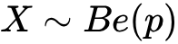
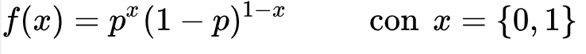
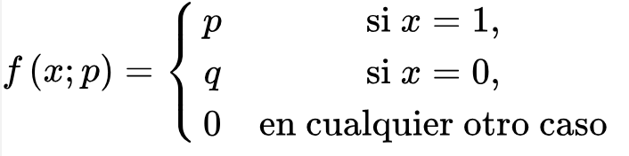
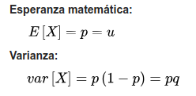
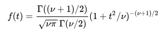
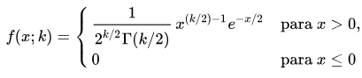

name: inverse
layout: true
class: center, middle, inverse
---
name: Inicio
#Curso de R y estadística básica
[Felipe de J. Muñoz González]

[fmunoz@lcg.unam.mx](mailto:fmunoz@lcg.unam.mx)
.footnote[Introducción<br>[Descargar Presentación](http://pipemg.github.io/CursoR_INMEGEN/Presentacion4.pdf)]
---

name: last-page
template: inverse

## Fenómenos aleatorios
---

layout: false
.left-column[
  ## Fenómenos aleatorios

]

.right-column[

En estadística, un **fenómeno aleatorio** es aquel que bajo el mismo conjunto aparente de condiciones iniciales, puede presentar resultados diferentes.

En un fenomeno aleatorio no se puede predecir el resultado exacto de cada experiencia particular. (Ej: Lanzamiento de un dado).

Este tipo de fenómeno es opuesto al fenómeno determinista, en el que conocer todos los factores de un experimento nos hace predecir exactamente el resultado del mismo. Por ejemplo, conociendo la altura desde la que se arroja un celular es posible saber exactamente el tiempo que tardará en llegar al suelo en condiciones de vacío.

Un experimento se dice **aleatorio** si verifica las siguientes condiciones:

 - Es posible conocer previamente todos los **resultados asociados** al experimento (el espacio muestral, constituido por diferentes sucesos).
 - Es **imposible predecir el resultado exacto** del mismo antes de realizarlo

]
---

layout: false
.left-column[
  ## Fenómenos aleatorios
   ### Nociones básicas sobre sucesos
]
.right-column[

El **espacio de resultados** o espacio muestral, Ω es el conjunto de todos los posibles resultados de un experimento aleatorio.

**Sucesos**

Llamaremos suceso a cualquier subconjunto de Ω. Un suceso A ocurre si el resultado del experimento aleatorio es uno de los elementos de A.

- Suceso complementario de A (A'): ocurre cuando el resultado del experimento no es un elemento de A.
- Suceso unión de A y B (A ∪ B): ocurre cuando ó bien sucede A ó bien sucede B.
- Suceso intersección de A y B (A ∩ B): ocurre cuando A y B suceden
simultáneamente

Cada uno de los elementos de Ω constituye un suceso. A estos sucesos se les
denomina sucesos elementales.

El propio Ω también constituye un suceso, al que se denomina suceso seguro

]

.right-column[
Nociones básicas sobre sucesos

]
---

layout: false
.left-column[
  ## Fenómenos aleatorios
   ### Nociones básicas sobre sucesos

]

.right-column[
Ejemplo 1

Se lanzan dos dados, uno rojo y otro azul. El espacio de resultados Ω estará
constituido por los 36 posibles resultados del experimento, es decir:
Ω = {(1, 1),(1, 2), . . . ,(1, 6),(2, 1), . . . ,(6, 6)}

- Los sucesos elementales son (1, 1), (1, 2), etc., es decir, cada uno de los 36
elementos de Ω.
- A = {rojo = 4} = {(4, 1),(4, 2),(4, 3),(4, 4),(4, 5),(4, 6)}
- B = {rojo + azul = 10} = {(4, 6),(5, 5),(6, 4)}
- A' = {rojo 6= 4}; B¯ = {rojo + azul 6= 10}
- A ∪ B = {(4, 1),(4, 2),(4, 3),(4, 4),(4, 5),(4, 6),(5, 5),(6, 4)}
- A ∩ B = {(4, 6)}


]
---

layout: false
.left-column[
  ## Fenómenos aleatorios
   ### Definición clásica de probabilidad


]

.right-column[

#### Probabilidad
La probabilidad es una medida para cuantificar la seguridad que tenemos de que
ocurra cada uno de los sucesos de un experimento aleatorio. A cada suceso A se le
asocia un valor, P(A), con 0 ≤ P(A) ≤ 1.

Si P(A) = 0, el suceso A no va a ocurrir. Si P(A) = 1, el suceso A va a ocurrir con
toda seguridad. Conforme mayor sea el número P(A) más verosímil es el suceso A.

#### Definición clásica

En la definición clásica de probabilidad, todos los resultados del experimento nos
resultan igualmente verosímiles, por lo que tendrán igual probabilidad.
De este modo, la probabilidad de un suceso A podrá ser calculada del siguiente modo:
P(A) = # de sucesos elementales faborables de A / # total de sucesos

Ejemplo
]
---

name: last-page
template: inverse

## Distribuciones de probabilidad

---

layout: false
.left-column[
  ## Distribuciones de probabilidad
   ### Definiciones
]

.right-column[
<br><br>
Cuando una **variable aleatoria** toma diversos valores, la probabilidad asociada a cada uno de tales valores puede ser organizada como una **distribucion de probabilidad**.

- Distribuciones discretas:  espacio muestral contiene un número infinito de posibilidades, igual al número de puntos en un segmento de recta.**Variable aleatoria continua** 

- Distribuciones continuas: son aquellas en donde el espacio muestral es contable. **Variable aleatoria discreta**


]

---
layout: false
.left-column[
  ## Distribuciones de probabilidad
   ### Distribuciones discretas 
]

.right-column[

Al lanzar una moneda tres veces, la variable X, representa el número de caras tendria las siguientes probabilidades:

| m       |   0    |   1    |    3   |    
|:-------:|:------:|:------:|:------:|
| P(M=m)  |  1/3   |   1/2  |  1/6   |  


Esto se escribe de la forma  f(x) = P(X=x); es decir, f(3)=P(X=3).

Al conjunto de pares ordenados se le llama **función de probabilidad**, función de masa de probabilidad o distribución de probabilidad de una variable aleatoria X.

El conjunto de pares ordenados (x,f(x)) es una función de probabilidad de la variable discreta X si:

1. f(X) >= 0
2. Σ<sub>1</sub><sup>n</sup>(f(x)) = 1
3. P(X = x) = f(x)


Ejemplo: Un embarque de 20 computadoras portátiles similares para una tienda minorista contiene 3 que están defectuosas. Si una escuela compra al azar 2 de estas computadoras, calcule la distribución de probabilidad para el número de computadoras defectuosas.

]

---

layout: false
.left-column[
  ## Distribuciones de probabilidad
   ### Distribuciones discretas 
]

.right-column[

Si una agencia automotriz vende 50% de su inventario de cierto vehículo extranjero equipado con bolsas de aire laterales, calcule una fórmula para la distribución de probabilidad del número de automóviles con bolsas de aire laterales entre los siguientes 4 vehículos que venda la agencia.

La **función de distribución acomulativa** F(x) de una variable aleatoria discreta X con distribución de probabilidad f(x) es:

F(x)=P(X<=x) = Σ<sub>t<=x</sub>(f(t)), para -∞< x <∞

Calcule y grafique la función de la distribución acumulativa de la variable aleatoria X del ejercicio anterior. Utilice F(x) para verificar que f(2) =3/8.

A menudo es útil ver una distribución de probabilidad en forma gráfi ca. Para esto se utiliza un histograma de probabilidades. para el ejemplo anterior:

```
x<-c(0,1,2,3,4)
prob<-c(1/16,4/16,6/16,4/16,1/16)

plot(x,prob,type="h")
barplot(prob)
```


]

---


layout: false
.left-column[
  ## Distribuciones de probabilidad
   ### Distribuciones continua 
]

.right-column[

Una variable aleatoria continua tiene una probabilidad 0 de adoptar exactamente cualquiera de sus valores. Para la variable aleatoria continua X  no importa si incluimos o no un extremo del intervalo:

P(a < X ≤ b) = P(a < X < b) + P(X = b) = P(a < X < b).


La distribución de probabilidad de una variable aleatoria continua no se puede tabular pero si se presenta como una formula. Esta formula se le conoce como **función de densidad de probabilidad** o **función de densidad** de una variable discreta X.

La función de densidad de probabilidad se construye de manera que el area bajo la curva limitada por el eje  sea igual a 1. 

P (a < X < b) = ∫<sub>a</sub><sup>b</sup>f(x)dx .


La función f (x) es una función de densidad de probabilidad (fdp) para la variable
aleatoria continua X, defi nida en el conjunto de números reales, si

1. f(x) >= 0 para toda x ∈ R
2. ∫<sub>-∞</sub><sup>∞</sup>f(x)dx =1
3. P(a < X < b ) = ∫<sub>a</sub><sup>b</sup> f(x)dx


]

---


layout: false
.left-column[
  ## Distribuciones de probabilidad
   ### Distribuciones continua 
]

.right-column[

Suponga que el error en la temperatura de reacción, en °C, en un experimento de laboratorio controlado, es una variable aleatoria continua X que tiene la función de densidad de
probabilidad

f(x) = x<sup>2</sup>/3 para -1 < x < 2, 0 para toda otra x

a) Verifique que f(x) es una función de densidad
b) Calcule P(0<X<=1) 

Existe una relación muy importante entre las funciones de distribución F(x) y de densidad f(x) de una variable aleatoria discreta. La función de distribución en un punto se obtiene acumulando el valor de la función de densidad para todos los valores del recorrido menores o iguales al punto en cuestión.

F(X) = SUM(f(xi)) para toda xi en X


]

---
layout: false
.left-column[
  ## Distribuciones de probabilidad
   ### Distribuciones continua 
]

.right-column[

La función de distribución acumulativa F(x), de una variable aleatoria continua X con función de densidad f (x), es 

F (x ) = P (X ≤ x ) = ∫<sup>x</sup> <sub>−∞</sub>f(t)dt, para −∞< x < ∞.

por lo tanto

P(a < X < b) = F(b)-F(a) 

y

f(x) = dF(x)/dx

Calcular F(x) para el ejemplo anterior utilizando P(0<X<=1)

]
---
layout: false
.left-column[
  ## Distribuciones de probabilidad
   ### Definiciones
]
.right-column[
<br><br>

| Función       | Distribución      |   Tipo    |       media   |                   varianza                |
|:-------------:|:-----------------:|:---------:|:-------------:|:-----------------------------------------:|
| bern          | Binomial          | Discreta  |    µ = np     |              σ<sup>2</sup>=npq            |
| geom          | geometrica        | Discreta  |    µ =1/p     |   σ<sup>2</sup>=(1-p)/p<sup>2</sup>       |
| hyper         | hipergeométrica   | Discreta  |    µ = nk/N   |  σ<sup>2</sup>=(N-n)/(n-1) n k/N(1 - k/N) |
| nbinom        | binomial negativa | Discreta  |    µ = [(r-1)(1-p)/p] si r>1, 0 si r<=1  | σ<sup>2</sup>= |
| pois          | Poisson           | Discreta  |    µ =  λ     |  σ<sup>2</sup> =  λ                       |
| beta          | beta              | Continua  |    µ = α/(α + β) | σ<sup>2</sup>=αβ/(α + β)<sup>2</sup> /(α + β + 1)  |

]
---

layout: false
.left-column[
  ## Distribuciones de probabilidad
   ### Definiciones
]
.right-column[
<br><br>

| Función       | Distribución      |   Tipo    |       media   |                   varianza                |
|:-------------:|:-----------------:|:---------:|:-------------:|:-----------------------------------------:|
| cauchy        | Cauchy–Lorentz    | Continua  |    µ = x<sub>0</sub>| Not Defined                         |
| exp           | exponencial       | Continua  |    µ = 1/λ    |  σ<sup>2</sup>= 1/λ<sup>2</sup>           |
| chisq         | chi-cuadrado      | Continua  |    µ = k      | σ<sup>2</sup>=2k                          |
| fisher        | F                 | Continua  |    µ =  d<sub>2</sub>/(d<sub>2</sub> - 2)    |  σ<sup>2</sup>= |
| gamma         | gamma             | Continua  |    µ =p/a     | σ<sup>2</sup> =p/a<sup>2</sup>            |
| logis         | logística         | Continua  |    µ = µ      | σ<sup>2</sup> = π<sup>2</sup>*s^2 /3      |
| norm          | normal            | Continua  |    µ = µ      |  σ<sup>2</sup> = σ<sup>2</sup>            |
| t             | t-Student         | Continua  |    µ = 0      | σ<sup>2</sup> = v/(v-2)                   |
| unif          | uniforme          | Continua  |  µ = (a+b)/2  |  σ<sup>2</sup>=(b-a)<sup>2</sup>/12       |

]   
---

layout: false
.left-column[
  ## Distribuciones de probabilidad
   ### Funciones en R
]
.right-column[
<br><br>
A cada nombre de función dado por R se le agrega un prefijo ‘d’ para obtener la función de densidad, ‘p’ para la función de distribución acumulada, ‘q’ para la función cuantil o percentil y ‘r’ para generar variables pseudo-aleatorias (random). La sintaxis es la siguiente:

> dxxx(x, ...)
> pxxx(q, ...)
> qxxx(p, ...)
> rxxx(n, ...)

Donde xxx indica el nombre de cualquiera de las distribuciones, x y q son vectores que toman valores en el soporte de la distribución, p es un vector de probabilidades y n es un valor entero.

]


---

layout: false
.left-column[
  ## Distribuciones de probabilidad
   ### Distribución Uniforme Discreta
]
.right-column[
Es la distribución de probabilidad se asocia a variables cuyos posibles valores tienen
todos la misma probabilidad. Si una variable aleatoria X cuyos posibles valores son
x1, . . . , xn, tiene distribución uniforme discreta entonces

P(X=x<sub>1</sub>)=P(X=x<sub>2</sub>)=P(X=x<sub>3</sub>)=...)P(X=x<sub>n</sub>)=1/n

Intuitivamente, esta variable está asociada al experimento similares al de elegir al azar
un número entre 1 y n sin disponer de ninguna información adicional.

- µ = (x1 + · · · + xn)/n= ¯x 

- σ2 = [(x1 − µ)^2 + · · · + (xn − µ)^2 ]/n
]


---

layout: false
.left-column[
  ## Distribuciones de probabilidad
   ### Proceso de Bernoulli
]
.right-column[

Los **procesos de Bernoulli** se refieren a experimentos que se repeten una cantidad finita de n veces en donde cada repetición tiene como resultado 2 opciones: éxito o fracaso. 

Un proceso de Bernoulli tiene las siguientes propiedades:

- El experimento se trata de la repetición de n ensayos. 

- Cada uno de los ensayo se clasifica en éxitos o no éxitos(fracaso).

- Cada uno de los ensayos son independientes.

- La probabilidad de que suceda un éxito es constante y a esta se la llama p, mientras que la probabilidad de no éxito también se mantiene constante y es q=1-p


Cuando se trata de procesos de Bernoulli existen 5 distribuciones asociadas la de bernulli(diatomica), la binomial, hipergeométrica, geométrica y la de Pascal.
]

---

layout: false
.left-column[
  ## Distribuciones de probabilidad
   ### Proceso de Bernoulli
]
.right-column[


Si **X** es una variable aleatoria que mide el _"número de éxitos"_, y se realiza un único experimento con dos posibles resultados (éxito o fracaso), se dice que la variable aleatoria **X**  se distribuye como una Bernoulli de parámetro **p**.

 


Su función de probabilidad viene definida por:

 

]
---


layout: false
.left-column[
  ## Distribuciones de probabilidad
   ### Distribución de Bernoulli
]
.right-column[


 

 

**Ejemplo**

"Lanzar dos monedas, probabilidad de conseguir que salga al menos una cruz".

Se trata de un experimento con el exito (p) que salga una o dos cruces. 
La probabilidad de sacar 1 cruz y cara es 1/2
La probabilidad de sacar 2 caras es 1/4

P(X=1) = 1/4
P(X=0) = 1/4
P(X=2) = 2/4

Por lo tanto al probabilidad de exito (p) es 3/4 
Mientras que la probabilidad de fracaso (1) es q=1-p igual a 1/4

X ~ Be(0,3/4)


---

layout: false
.left-column[
  ## Distribuciones de probabilidad
   ### Distribución Binomial
]
.right-column[

La distribución  binomial es una distribucón de probabilidad que toma valor 1 para la probabilidad de éxito (p) y valor q para la probabilidad de fracaso (q = 1 − p).

Se dice que la variable aleatoria X se distribuye como una Binomial de
parametro p si sigue un proceso de bernulli. 

 - Los experimentos constan de n ensayos repetidos
 - Cada ensayo se clasifica como éxito o fracaso
 - La probabilidad de éxito p es constante
 - Los ensayos son independientes

f(x) = p<sup>x</sup> (1 − p)<sup>1-x</sup>; con x = {0, 1}

P(X = 1) = p , P(X = 0) = 1 − p , 0 < p < 1

µ = p 

σ^2 = p(1 − p)

]
---

layout: false
.left-column[
  ## Distribuciones de probabilidad
   ### Distribución Binomial
]
.right-column[

Ejemplo

Con objeto de estudiar el número de salmones de cierto río que llegan vivos al mar se
marca el 20% de la camada en el lugar de nacimiento. Posteriormente, en una estación
de seguimiento río abajo, se registra el paso de 10 salmones de dicha camada. 

¿Cuál es la probabilidad de que se registren 3 de los marcados? 
¿Y con qué probabilidad se registrarán 2 ó menos de los marcados?

X ≡ número de salmones marcados que se registran ∼ B(10, 0.2)
P(X = 3) = conv(10,3) * 0.2^3 * 0.8 ^ 7 = 

10!*0.2^3*.08^7 /(3! 7!)  = 0.2013

P(X ≤ 2) =P(X = 0) + P(X = 1) + P(X = 2)
=0.1074 + 0.2684 + 0.3020 = 0.6778
]

---

layout: false
.left-column[
  ## Distribuciones de probabilidad
   ### Distribución Binomial
]
.right-column[
<br><br>
- dbinom(x, size, prob, log = F); Devuelve resultados de la función de densidad.
- pbinom(q, size, prob, lower.tail = T, log.p = F); Devuelve resultados de la función de distribución acumulada.
- qbinom(p, size, prob, lower.tail = T, log.p = F); Devuelve resultados de los cuantiles de la binomial.
- rbinom(n, size, prob); Devuelve un vector de valores binomiales aleatorios.

Con:
- x, q: Vector de cuantiles.
- p: Vector de probabilidades.
- n: Número de observaciones
- size: Números de ensayos(debe ser cero o máss).
- prob: Probabilidad de éxito en cada ensayo.
- log, log.p: Parámetro booleano, si es TRUE, las probabilidades p se ofrecen como log(p).
- lower.tail: Parámetro booleano, si es TRUE (por defecto), las probabilidades son P[X ≤ x], de lo contrario, P[X > x].

]
---
layout: false
.left-column[
  ## Distribuciones de probabilidad
   ### Distribución Binomial
]
.right-column[
<br><br>
```
> dbinom(3, 10, 0.5) # Calculamos la P(X=3) de una Binomial(10,0.5) 
> dbinom(6, 10, 0.5) # Calculamos la P(X=6) de una Binomial(10,0.5)
> dbinom(c(2, 1, 0), 10, 0.5) # Calculamos la P(X=2,1,0) de una Binomial(10,0.5)
> sum(dbinom(c(2, 1, 0), 10, 0.5)) # Calculamos la P(X<=2) de una Binomial(10,0.5)
> sum(dbinom(c(0, 1, 2), 10, 0.5))
> # Que coincide con la función pbinom
> pbinom(2,10,0.5)
> pbinom(2,10,0.5, lower.tail=F) # Calculamos la P(X>2) de una Binomial(10,0.5)
> pbinom(10,10,0.5) 
> qbinom(c(0.90), 10, 0.5)# Los valores de X que tiene una probabilidad de ocurrir en torno al 90%
> qbinom(c(0.95), 10, 0.5) # Los valores de X que tiene una probabilidad de ocurrir en torno al 95%
> rbinom(2,10,0.5) # 2 números aleatorios de una binomial
> rbinom(9,10,0.5)  # 9 números aleatorios de una binomial

```

]
---

layout: false
.left-column[
  ## Distribuciones de probabilidad
   ### Distribución Binomial
]
.right-column[
<br><br>
### Ejemplo

Considere un conjunto de experimentos de Bernoulli en el que se seleccionan tres articulos al azar de un proceso de producción, luego seinspeccionan y se clasifican como defectuosos o no defectuosos. Un artículodefectuoso se designa como éxito. El número de éxitos es una variable aleatoriaX que toma valores integrales de 0 a 3. Los ocho resultadosposibles son.

|  **Resultado**  | NNN | NDN | NND | DNN | NDD | DND | DDN | DDD |
|:---------------:|:---:|:---:|:---:|:---:|:---:|:---:|:---:|:---:|
|        x        |  0  |  1  |  1  |  1  |  2  |  2  |  2  |  3  |

Los artículos se seleccionan de forma independiente y se asume que el proceso produce 25% de artículos defectuosos.

P(NDN) = P(N)P(D)P(N) = (3/4)(1/4)(3/4) = 9/64

]

---

layout: false
.left-column[
  ## Distribuciones de probabilidad
   ### Distribución Binomial
]
.right-column[
<br><br>
El número x de éxitos en n experimentos de Bernoulli se denomina **Variable aleatoria binomial**. La  distribución de probabilidades de esta variable aleatoria discreta se llama **distribución binomial**.

- Se denota como b(x,n,p)

Para la distribución de probabilidad de X es:

- P(X=2) = f(2) = b(2;3,1/4) = 9/64

En forma general, una probabilidad p de éxito y q=1-p el fracaso. La distribucion de la variable aleatoria binomial X, el númerode éxitos en n ensayos independientes es:

- b(x;n,p) = Conv(n,x)p<sup>x</sup>q<sup>n-x</sup>, x = 0,1,2,3,4,...,n

- (q + p)<sup>n</sup> = Conv(n,0) q<sup>n</sup> + Conv(n,1) p<sup>1</sup>q<sup>n-1</sup> + Conv(n,2) p<sup>2</sup>q<sup>n-2</sup> + ... + Conv(n,n) p<sup>n</sup>

- p + q = 1  -->  sum(b(x;n,p)) =1
]

---
layout: false
.left-column[
  ## Distribuciones de probabilidad
   ### Experimentos multinominal
]
.right-column[
<br><br>

Un experimento bimodal se convierte en un experimento **multinominal** si cada prueba contiene más de dos resultados posibles. 

En general, si un ensayo puede tener una de las k consecuencias E<sub>1</sub>,E<sub>2</sub>,E<sub>3</sub>,...,E<sub>k</sub> con probabilidad P<sub>1</sub>,P<sub>2</sub>,P<sub>3</sub>,...,P<sub>k</sub>, la **distribución multinomial** dará la probabilidad de que E<sub>i</sub> ocurra x<sub>i</sub> veces, donde

x<sub>1</sub> + x<sub>2</sub> + ... + x<sub>k</sub> = n

denotamos esta distribución como

f(x<sub>1</sub>,x<sub>2</sub>,...,x<sub>k</sub>;p<sub>1</sub>,p<sub>2</sub>,...,p<sub>k</sub>)

]

---
layout: false
.left-column[
  ## Distribuciones de probabilidad
   ### Experimentos multinominal

]
.right-column[
<br><br>

**Ejemplo**
La complejidad de las llegadas y salidas de los aviones en un aeropuerto es tal que a menudo se utiliza la simulación para modelar las condiciones "ideales". Para un aeropuerto A se tienen 3 pistas de aterrizaje y un avión llega con las siguientes probabilidades.

- Pista 1: p<sub>1</sub> = 4/18
- Pista 2: p<sub>2</sub> = 3/18
- Pista 3: p<sub>3</sub> = 11/18

¿Cuál es la probabilidad de que 6 aviones que llegan al azar se distribuyan de la siguiente manera?

- Pista 1: 2 aviones
- Pista 2: 1 avión
- Pista 3: 3 aviones

f(2,1,3;4/18,3/18,11/18,6) = 6!/2!1!3! * 2<sup>2</sup>/9<sup>2</sup> * 11<sup>3</sup>/18<sup>3</sup> = 0.1127

]

---

layout: false
.left-column[
  ## Distribuciones de probabilidad
   ### Distribución Geométrica

]
.right-column[

<br><br>

La distribución Geométrica es una serie de ensayos de Bernoulli independientes, con probabilidad constante p de éxito, donde la variable aleatoria X denota el número de ensayos hasta el primer éxito.

 - X ~ G(p)

 - f(x) = p(1-p)<sub>x-1</sub>; con x={0,1}

```
 - dgeom(x, prob, log = F); Devuelve resultados de la función de densidad.
 - pgeom(q, prob, lower.tail = T, log.p = F); Devuelve resultados de la función de distribución acumulada.
 - qgeom(p, prob, lower.tail = T, log.p = F); Devuelve resultados de los cuantiles de la Geométrica.
 - rgeom(n, prob); Devuelve un vector de valores binomiales aleatorios.

```
]

---

layout: false
.left-column[
  ## Distribuciones de probabilidad
   ### Distribución Geométrica

]
.right-column[
<br><br>
con:

 - x, q: Vector de cuantiles que representa el número de fallos antes del primer éxito.
 - p: Vector de probabilidades.
 - n: Números de valores aleatorios a devolver.
 - prob: Probabilidad de éxito en cada ensayo.
 - log, log.p: Parámetro booleano, si es TRUE, las probabilidades p se ofrecen como log(p).
 - lower.tail: Parámetro booleano, si es TRUE (por defecto), las probabilidades son P[X ≤ x], de lo contrario, P[X > x].

]

---

layout: false
.left-column[
  ## Distribuciones de probabilidad
   ### Distribución Geométrica
]
.right-column[

<br><br>

```
> dgeom(4, 0.5) # Calculamos la P(X=4) de una G(0.5); representa el número de fallos antes del primer éxito

> pgeom(4, 0.5, lower.tail = F) # Calculamos la P(X>4) de una G(0.5) > # Que en este caso coincide con dgeom(4, 0.5)

> Lo comprobamos; P(X > 4) = 1 - P(X<=3) = 1 - [P(X=0)+P(X=1)+P(X=2)+P(X=3)+P(X=4)]
> 1 - (dgeom(0, 0.5) + dgeom(1, 0.5) + dgeom(2, 0.5)+ dgeom(3, 0.5) + dgeom(4, 0.5))

```
]

---

layout: false
.left-column[
  ## Distribuciones de probabilidad
   ### Distribución Binomial Negativa
]
.right-column[
<br><br>
Surge de un contexto semejante al que conduce a la distribución geométrica. La distribución que asigna a la variable Y, el número de 
ensayo en el que ocurre el r-ésimo éxito.

Entonces X tiene una distribución Binomial Negativa.

 - X ~ BN(x,r,p)

su función de probabilidad

 - P(y) = conv(x-1,r-1)p<sup>r</sup>q<usp>x-r</sup>; para x {r,r+1,r+2,...}
]
---

layout: false
.left-column[
  ## Distribuciones de probabilidad
   ### Distribución Binomial Negativa
]
.right-column[
<br><br>

Para obtener valores que se basen en la distribución Binomial Negativa, R dispone de cuatro funciones basados en “nbinom”:

- dnbinom(x, size, prob, mu, log = F); Devuelve resultados de la función de densidad.

- pnbinom(q, size, prob, mu, lower.tail = T, log.p = F); Devuelve resultados de la función de distribución acumulada.

- qnbinom(p, size, prob, mu, lower.tail = T, log.p = F); Devuelve resultados de los cuantiles de la Binomial Negativa.

-rnbinom(n, size, prob, mu); Devuelve un vector de valores binomiales aleatorios.


]
---

layout: false
.left-column[
  ## Distribuciones de probabilidad
   ### Distribución Binomial Negativa
]
.right-column[
con:
- x, q: Vector de cuantiles (Valores enteros positivos). Corresponde a número de pruebas falladas.
- q: Vector de cuantiles.
- p: Vector de probabilidades.
- n: Números de valores aleatorios a devolver.
- prob: Probabilidad de éxito en cada ensayo.
- size: Número total de ensayos. Debe ser estrictamente positivo.
- mu: Parametrización alternativa por la media.
- log, log.p: Parámetro booleano, si es TRUE, las probabilidades p se ofrecen como log(p).
- lower.tail: Parámetro booleano, si es TRUE (por defecto), las probabilidades son P[X ≤ x], de lo contrario, P[X > x].

```
> # Suponga que el 60% de los elementos no están defectuosos.
> # Para encontrar la probabilidad de localizar el quinto elemento sin defecto en el séptimo ensayo.
> # Calculamos P(X = 7), con r=5
> dnbinom(7-5, 5, 0.6)
> # si queremos calcular en el séptimo ensayo o antes
> pnbinom(7-5, 5, 0.6, lower.tail = T)
```
]
---

layout: false
.left-column[
  ## Distribuciones de probabilidad
   ### Distribución De Poisson
]
.right-column[
La distribución de Poisson expresa la probabilidad de un número k de eventos ocurriendo en un tiempo fijo si estos eventos ocurren con una frecuencia media conocida y son independientes del tiempo discurrido desde el último evento.

- X ~ P(λ)

La función de densidad de la distribución de Poisson es:

- f(k,λ) = e<sup>-λ</sup>λ<sup>k</sup>/k!

Para obtener valores que se basen en la distribución de Poisson, R dispone de cuatro funciones basados en“pois”:
- dpois(x, lambda, log = F); Devuelve resultados de la función de densidad.
- ppois(q, lambda, lower.tail = T, log.p = F); Devuelve resultados de la función de distribución acumulada.
- qpois(p, lambda, lower.tail = T, log.p = F); Devuelve resultados de los cuantiles de la Poisson.
- rpois(n, lambda); Devuelve un vector de valores binomiales aleatorios
]


---

layout: false
.left-column[
  ## Distribuciones de probabilidad
   ### Distribución normal
]
.right-column[
La distribución normal, distribución de Gauss o distribución gaussiana, a una de las distribuciones de probabilidad de variable continua que con más frecuencia aparece en fenómenos reales.

Se dice que una variable aleatoria continua X sigue una distribución normal de parámetros µ y σ y se denota X ∼ N(µ, σ) si su función de densidad está dada por:


 
Intuitivamente, es la distribución de probabilidad que se asume para una variable
cuyos posibles valores se disponen de forma simétrica en torno a su media de modo
que los valores próximos a dicha media tendrán mayor probabilidad de ser
alcanzados. Conforme más alejados estén de la media, los valores tienen menor
probabilidad de ser alcanzados.

]
---

layout: false
.left-column[
  ## Distribuciones de probabilidad
   ### Distribución normal
]
.right-column[

Para obtener valores que se basen en la distribución normal, R dispone de cuatro funciones basados en “norm”:


- dnorm(x, mean = 0, sd = 1, log = F); Resultados de la función de densidad.
- pnorm(q, mean = 0, sd = 1, lower.tail = T, log.p = F); Resultados de distribución acumulada.
- qnorm(p, mean = 0, sd = 1, lower.tail = T, log.p = F); Resultados de los cuantiles de la Normal.
- rnorm(n, mean = 0, sd = 1); Vector de valores normales aleatorios.
]

---

layout: false
.left-column[
  ## Distribuciones de probabilidad
   ### Distribución normal
]
.right-column[
<br><br>
```
> # Calcular la P(Z>1) de una N(0,1)
> pnorm(1, mean = 0, sd = 1, lower.tail = F)
> # Calcular la P(-2<Z<2) de una N(0,1)
> pnorm(c(2), mean = 0, sd = 1) - pnorm(c(-2), mean = 0, sd = 1)
> # Calcular la P(0<Z<1.96) de una N(0,1)
> pnorm(1.96, mean = 0, sd = 1) - pnorm(0, mean = 0, sd = 1)
> # Calcular la P(Z<=z)=0,5793 de una N(0,1)
> qnorm(0.5793, mean = 0, sd = 1)
> # Calcular la P(Z>150) de una Normal de media 125 y la desviación esaándar 50.
> pnorm(150, mean = 125, sd = 50, lower.tail = F)
```
]

---

layout: false
.left-column[
  ## Distribuciones de probabilidad
   ### Distribución normal
]
.right-column[
La vida de un semiconductor láser a una potencia constante se distribuye
normalmente con media 7000 horas y desviación típica 600 horas. ¿Cuál es la
probabilidad de que la vida del láser esté entre 6280 y 7120 horas?

X ≡ vida del semiconductor (en horas) ∼ N(7000, 600)

Tipificación:
Z = (X − 7000)/600 ∼ N(0, 1)

(6280 − 7000)/600 ) −1.2 

(7120 − 7000)/600 = 0.2

P(6280 ≤ X ≤ 7120) = P(−1.2 ≤ Z ≤ 0.2)
=P(Z ≤ 0.2) − P(Z ≤ −1.2) = 0.5793 − 0.1151 = 0.4642

]


---

layout: false
.left-column[
  ## Distribuciones de probabilidad
   ### Distribución t-Student
]
.right-column[

La distribución t-Student es una distribución de probabilidad que surge del problema de estimar la media de una población normalmente distribuida cuando el tamaño de la muestra es pequeño.

La distribución de probabilidad t de Student con n grados de libertad (t(n)) es la
asociada a una variable aleatoria que se obtiene a partir del cociente de una variable
N(0, 1) y la raíz cuadrada de una variable χ^2(n).

La distribución t de Student es la distribución de probabilidad del cociente:

- Z/sqrt(V/v)

donde:
1. Z tiene una distribución normal de media nula y varianza 1
2. V tiene una distribución chi-cuadrado con ν grados de libertad
3. Z y V son independientess
La función de densidad de t es

 Test-T</img>

```
> qpois(0.985, 3)
```
]
---

layout: false
.left-column[
  ## Distribuciones de probabilidad
   ### Distribución normal

]
.right-column[

La distribución normal, distribución de Gauss o distribución gaussiana, a una de las distribuciones de probabilidad de variable continua que con más frecuencia aparece en fenómenos reales.

La gráfica de su función de densidad tiene una forma acampanada y es simétrica respecto de un determinado parámetro. Esta curva se conoce como **campana de Gauss**. 


Se dice que una variable aleatoria continua X sigue una distribución normal de parámetros µ y σ y se denota X ∼ N(µ, σ) si su función de densidad está dada por:


</img> 

]
---

layout: false
.left-column[
  ## Distribuciones de probabilidad
   ### Distribución normal
]
.right-column[


- dnorm(x, mean = 0, sd = 1, log = F); Devuelve resultados de la función de densidad.
- pnorm(q, mean = 0, sd = 1, lower.tail = T, log.p = F); Devuelve resultados de la función de distribución acumulada.
- qnorm(p, mean = 0, sd = 1, lower.tail = T, log.p = F); Devuelve resultados de los cuantiles de la
Normal.
- rnorm(n, mean = 0, sd = 1); Devuelve un vector de valores normales aleatorios.

Con:
 - x, q: Vector de cuantiles.
 - p: Vector de probabilidades.
 - n: Números de observaciones.
 - mean: Vector de medias. Por defecto, su valor es 0.
 - sd: Vector de desviación estándar. Por defecto, su valor es 1
 - log, log.p: Parámetro booleano, si es TRUE, las probabilidades p son devueltas como log (p).
 - lower.tail: Parámetro booleano, si es TRUE (por defecto), las probabilidades son P[X ≤ x], de lo
contrario, P[X > x].

]
---

layout: false
.left-column[
  ## Distribuciones de probabilidad
   ### Distribución normal
]
.right-column[
<br><br>
```
> # Calcular la P(Z>1) de una N(0,1)
> pnorm(1, mean = 0, sd = 1, lower.tail = F)
> # Calcular la P(-2<Z<2) de una N(0,1)
> pnorm(c(2), mean = 0, sd = 1) - pnorm(c(-2), mean = 0, sd = 1)
> # Calcular la P(0<Z<1.96) de una N(0,1)
> pnorm(1.96, mean = 0, sd = 1) - pnorm(0, mean = 0, sd = 1)
> # Calcular la P(Z<=z)=0,5793 de una N(0,1)
> qnorm(0.5793, mean = 0, sd = 1)
> # Calcular la P(Z>150) de una Normal de media 125 y la desviación estándar 50.
> pnorm(150, mean = 125, sd = 50, lower.tail = F)

```
]

---


layout: false
.left-column[
  ## Distribuciones
   ### Distribución Z
]
.right-column[
<br><br>

Valor estandarizado, cuando queremos comparar datos en escala que es independiente a la medida.

Dado X=x[1], x[2], x[3], ... ,x[n] los z-scores son z[1], z[2],...z[n] se ven definidos como

z[i]=(x[i]-median(x))/s 

donde s es la sd()


```
> ?scale

```
]
---

layout: false
.left-column[
  ## Distribuciones de probabilidad
   ### Distribución t-Student
]
.right-column[

La distribución t-Student es una distribución de probabilidad que surge del problema de estimar la media
de una población **normalmente distribuida** cuando el **tama˜no de la muestra es peque˜no**.

Aparece de manera natural al realizar la prueba t de Student para la determinación de las diferencias entre dos medias muestrales y para la construcción del intervalo de confianza para la diferencia entre las medias de dos poblaciones cuando se desconoce la desviación típica de una población y ésta debe ser estimada a partir de los datos de una muestra.

T = Z/sqrt(V/v)

- Z variable aleatoria distribuida segun una normal típica (media = 0, varianza=1)
- V es una variable con distribución chi^2
- Z y V son independientes
]
---
layout: false
.left-column[
  ## Distribuciones de probabilidad
   ### Distribución t-Student
]
.right-column[

- dt(x, df, ncp, log = F); Devuelve resultados de la función de densidad.
- pt(q, df, ncp, lower.tail = T, log.p = F); Devuelve resultados de la función de distribución acumulada.
- qt(p, df, ncp, lower.tail = T, log.p = F); Devuelve resultados de los cuantiles de la t-Student.
- rt(n, df, ncp); Devuelve un vector de valores t-Student aleatorios.

Con:
- x, q: Vector de cuantiles.
- p: Vector de probabilidades.
- n: Números de observaciones.
- df: Grados de libertad.
- ncp: Parámetro que determina la centralidad de la gráfica t-Student. Si se omite, el estudio se realiza con la gráfica centralizada en 0.
- log, log.p: Parámetro booleano, si es TRUE, las probabilidades p son devueltas como log (p).
- lower.tail: Parámetro booleano, si es TRUE (por defecto), las probabilidades son P[X ≤ x], de lo
contrario, P[X > x].

]
---
layout: false
.left-column[
  ## Distribuciones de probabilidad
   ### Distribución t-Student
]
.right-column[
<br><br>
```
> # Calcular P(T >= 1.3) con 7 grados de libertad.
> pt(1.3, 7, lower.tail = F)
> # Calcular P(T < 2.30) con 20 grados de libertad.
> pt(2.30,20, lower.tail = T)
> # P(T >= t) = 0.05 con 25 grados de libertad.
> qt(0.05, 25, lower.tail = F)
> # Calcular 5 números aleatorios con 25 grados de libertad.
> rt(5, 25)
```
]

---
layout: false
.left-column[
  ## Distribuciones de probabilidad
   ### Distribución Chi-cuadrado
]
.right-column[
<br><br>
En estadística, la distribución X<sup>2</sup> (de Pearson) es una distribución de probabilidad continua con un parámetro k que representa los grados de libertad de la variable aleatoria:

X = Z<sup>2</sup><sub>1</sub> + Z<sup>2</sup><sub>2</sub>+. · · + Z<sup>2</sup><sub>k</sub>

donde Z<sub>i</sub> son variables de distribución normal, de media cero y varianza uno. 

 </img>

donde Γ es la función gamma

]


---
layout: false
.left-column[
  ## Distribuciones de probabilidad
   ### Distribución Chi-cuadrado
]
.right-column[

La distribución de probabilidad chi-cuadrado con n grados de libertad (χ^2(n)) es la
asociada a una variable aleatoria que se obtiene como suma de los cuadrados de n variables independientes con distribución N(0, 1).

Por tanto, esta distribución sólo toma valores positivos y además su función de
densidad es muy compleja. (Graficar una chi cubica y chi cuadrada)

Intuitivamente, esta distribución es de utilidad para obtener información de la varianza
poblacional a partir de un conjunto de datos extraídos de una variable normal.

]
---
layout: false
.left-column[
  ## Distribuciones de probabilidad
   ### Distribución Chi-cuadrado
]
.right-column[

Ejemplo 

]

---
layout: false
.left-column[
  ## Distribuciones de probabilidad
   ### Distribución Chi-cuadrado
]
.right-column[
<br><br>
```
- dchisq(x, df, ncp=0, log = F); Devuelve resultados de la función de densidad.
- pchisq(q, df, ncp=0, lower.tail = T, log.p = F); Devuelve resultados de la función de distribución
acumulada.
- qchisq(p, df, ncp=0, lower.tail = T, log.p = F); Devuelve resultados de los cuantiles de la chi-Cuadrada.
- rchisq(n, df, ncp=0); Devuelve un vector de valores chi-Cuadrados aleatorios.

```

Con:
- x, q: Vector de cuantiles.
- p: Vector de probabilidades.
- n: Números de observaciones.
- df: Grados de libertad.
- ncp: Parámetro que determina la centralidad de la gráfica chi-Cuadrados. Si se omite, el estudio se
realiza con la gráfica centralizada en 0.
- log, log.p: Parámetro booleano, si es TRUE, las probabilidades p son devueltas como log (p).
lower.tail: Parámetro 

]

---
layout: false
.left-column[
  ## Distribuciones de probabilidad
   ### Distribución Chi-cuadrado
]
.right-column[
<br><br>
```
> # Calcular X^2(0.52, 7) con 7 grados de libertad.
> qchisq(0.52, 7, lower.tail = F)
> # P(X^2 < x) = 0.80 con 25 grados de libertad
> qchisq(0.8, 25, lower.tail = T)
> # P(X^2 >= 18.49) con 24 grados de libertad.
> pchisq(18.49, 24, lower.tail = F)
> # Calcular 5 números aleatorios de una dist. Chi-cuadrado con 24 grados de libertad.
> rchisq(5, 24)

```
]
---

layout: false
.left-column[
  ## Distribuciones de probabilidad
   ### Distribución F
]
.right-column[


La distribución de probabilidad F de Snedecor con n y m grados de libertad (F(n, m))
es la asociada a una variable aleatoria que se obtiene a partir del cociente de una dos
variables chi-cuadrado con n y m grados de libertad respectivamente.
Por tanto, esta distribución sólo tomar valores positivos. Su función de densidad es
muy compleja y su gráfica es parecida a la de la distribución chi-cuadrado


La distribución F de Snedecor es una distribución de probabilidad continua. Una variable aleatoria de
distribución F se construye como el siguiente cociente:

F=U<sub>1</sub>d<sub>1</sub> / U<sub>2</sub>d<sub>2</sub>

- U1 y U2 siguen una distribución chi-cuadrada con d1 y d2 grados de libertad respectivamente, y
- U1 y U2 son estadísticamente independientes

]

---

layout: false
.left-column[
  ## Distribuciones de probabilidad
   ### Distribución F
]
.right-column[
```
df(x, df1, df2, ncp, log = F); Devuelve resultados de la función de densidad.
pf(q, df1, df2, ncp, lower.tail = T, log.p = F); Devuelve resultados de la función de distribución acumulada.
qf(p, df1, df2, ncp, lower.tail = T, log.p = F); Devuelve resultados de los cuantiles de la distribución F.
rf(n, df1, df2, ncp); Devuelve un vector de valores de la distribución F aleatorios.
 ```
Con:
- x, q: Vector de cuantiles.
- p: Vector de probabilidades.
- n: Números de observaciones.
- df1, df2: Grados de libertad, df1 corresponde al numerador y df2 al denominador.
- ncp: Parámetro que determina la centralidad de la gráfica de la distribución F. Si se omite, el estudio se realiza con la gráfica no centralizada.
- log, log.p: Parámetro booleano, si es TRUE, las probabilidades p son devueltas como log (p).
- lower.tail: Parámetro booleano, si es TRUE (por defecto), las probabilidades son P[X ≤ x], de lo
contrario, P[X > x].

]
---
layout: false
.left-column[
  ## Distribuciones de probabilidad
   ### Distribución F
]
.right-column[

```
> # Calcular F(0.15, 3, 2). con 3 y 2 grados de libertad.
> qf(0.15, 3, 2, lower.tail=F)
> # P(F < f) = 0.025 con df1 = 20 y df2 = Infinito.
> qf(0.025, 20, Inf, lower.tail=T)
> # P(F >= 198.50) con df1 = 10 y df2 = 2.
> pf(198.50, 10, 2, lower.tail=F)
> # Calcular 5 números aleatorios de una dist. F de Snedecor con 24 y 10 grados de libertad.
> rf(5,24,10)
```
]

---

layout: false
.left-column[
  ## Distribuciones de probabilidad
   ### Distribución uniforme continua
]
.right-column[
Distribuciones Uniforme Continua en el intervalo [a, b] (U[a, b])
Es la distribución de probabilidad que se asocia a variables aleatorias que pueden
tomar cualquier valor en el intervalo [a, b] y cuya función de densidad es

f(x) = 1/(a-b) donde x esta en [a,b]

Intuitivamente, es la distribución de probabilidad que se asocia a experimentos
similares a elegir un número al azar entre los valores a y b.

(Falta gráfica)
---

layout: false
.left-column[
  ## Distribuciones de probabilidad
   ### Distribución beta
]
.right-column[
<br><br>
En estadística la distribución beta es una distribución de probabilidad continua con dos parámetros a y b cuya función de densidad para valores 0 < x < 1 es
 
 

Donde Γ es la función gamma. 
]
---

layout: false
.left-column[
  ## Distribuciones de probabilidad
   ### Distribución beta
]
.right-column[
```
- dbeta(x, shape1, shape2, ncp = 0, log = F); Devuelve resultados de la función de densidad.
- pbeta(q, shape1, shape2, ncp = 0, lower.tail = T, log.p = F); Devuelve resultados de la función de
distribución acumulada.
- qbeta(p, shape1, shape2, ncp = 0, lower.tail = T, log.p = F); Devuelve resultados de los cuantiles de la
distribución Beta.
- rbeta(n, shape1, shape2, ncp = 0); Devuelve un vector de valores de la distribución Beta aleatorios.

```

Con:
- x, q: Vector de cuantiles.
- p: Vector de probabilidades.
- n: Números de observaciones.
shape1, shape2: Parámetros de la Distribución Beta. Shape1 = α y Shape2 = β. Ambos deben ser
positivos.
- ncp: Parámetro lógico que determina si la distribución es central o no.
- log, log.p: Parámetro booleano, si es TRUE, las probabilidades p son devueltas como log (p).
- lower.tail: Parámetro booleano, si es TRUE (por defecto), las probabilidades son P[X ≤ x], de lo
contrario, P[X > x].

]

---

layout: false
.left-column[
  ## Distribuciones de probabilidad
   ### Distribución beta
]
.right-column[
<br><br>
```
> # Mediante una distribución beta con ALPHA = 5 y BETA = 4.
> # Calcule la probabilidad al menos del 75%
> pbeta(0.75, 5, 4, lower.tail = F)
> # Menos del 50%
> pbeta(0.5, 5, 4, lower.tail = T)
> # P(X < x)=0.25
> qbeta(0.25, 5, 4, lower.tail = T)
> # P(X > x) = 0.5
> qbeta(0.5, 5, 4, lower.tail = F)
> # Calcular 5 números aleatorios de una dist. Beta con ALPHA = 5 y BETA = 4
> rbeta(5,5,4)

```
 

]

---

layout: false
.left-column[
  ## Distribuciones de probabilidad
   ### Distribución gamma
]
.right-column[
```
- dgamma(x, shape, rate, scale = 1/rate, log = F); Devuelve resultados de la función de densidad.
- pgamma(q, shape, rate, scale = 1/rate, lower.tail = T, log.p = F); Devuelve resultados de la función
acumulada.
- qgamma(p, shape, rate, scale = 1/rate, lower.tail = T, log.p = F); Devuelve resultados de los cuantiles
de la distribución Gamma.
- rgamma(n, shape, rate, scale = 1/rate); Devuelve un vector de valores de la distribución Gamma aleatorios.
```

Con:
- x, q: Vector de cuantiles.
- p: Vector de probabilidades.
- n: Números de observaciones.
- rate: Alternativa para especificar el valor de escala (Scale). Por defecto, su valor es igual a 1.
shape, scale: Parámetros de la Distribución Gamma. Shape = a y Scale = s = 1/rate. Debe ser estrictamente positivo el parámetro Scale.
- log, log.p: Parámetro booleano, si es TRUE, las probabilidades p son devueltas como log (p).
- lower.tail: Parámetro booleano, si es TRUE (por defecto), las probabilidades son P[X ≤ x], de lo
contrario, P[X > x].

]

---

layout: false
.left-column[
  ## Distribuciones de probabilidad
   ### Distribución gamma
]
.right-column[
```
> # Mediante una distribución gamma con ALPHA = 3 y BETA = 0.5.
> # Calcule la probabilidad de que sea mejor de 10
> pgamma(10, 3, rate = 0.5, lower.tail = F)
> # Entre 4 y 8
> pgamma(8, 3, rate = 0.5, lower.tail = T) - pgamma(4, 3, rate = 0.5, lower.tail = T)
> # P(X <x) = 0.7
> qgamma(0.7, 3, rate = 0.5, lower.tail = T)
> # P(X > x) = 0.5
> qgamma(0.5, 3, rate = 0.5, lower.tail = F)
> # Calcular 5 números aleatorios de una dist. gamma con ALPHA = 3 y BETA = 0.5
> rgamma(5, 3, rate = 0.5)
```
]

---
layout: false
.left-column[
  ## Regresión
   ### Definición
]
.right-column[

La regresión es una técnica estadística que analiza la relación de dos o mas variables que principalmente se utilizada para inferir datos a partir de otros y hallar una respuesta de lo que puede suceder. Esta nos permite conocer el cambio en una de las variables llamadas respuesta y que corresponde a otra conocida como variable explicativa.

Se pueden encontrar varios tipos de regresión, por ejemplo:
- Regresión lineal simple
- Regresión múltiple ( varias variables)
- Regresión logística

Algunas ecuaciones regresión son:
- Regresión Lineal : y = A + Bx
- Regresión Logarítmica : y = A + BLn(x)
- Regresión Exponencial : y = Ac(bx)
- Regresión Cuadrática : y = A + Bx +Cx2

]

---
layout: false
.left-column[
  ## Regresión
   ### Regresión lineal
]
.right-column[
La función en R para obtener modelos de regresión lineal simple, Y=aX+b, es “lm”, aunque también se
puede utilizar esta función para el análisis de la varianza y análisis de covarianza.

```
> a.docencia <- c(3,1,1,2,5,6,12,7,3,10,6,11,4,4,16,4,5,3,5,2)
> edad <- c(35,27,26,30,33,42,51,35,45,37,43,36,36,56,29,35,37,29,34,29)
> # Y=a~nos de docencia y X=edad
> lm(a.docencia~edad)->r1
> r1

```

Hay que tener en cuenta que el orden en el que se escriben las variables es de gran importancia, en este caso la variable dependiente es los a˜nos de docencia.

y=a<sub>0</sub>+a<sub>1</sub>x

y = edad

x = años de docencia

Por lo tanto, la recta es: y(x) = (1,3081) − (0,1156)x

Ejercicio: Realizar el caso donde la variable dependiente es la edad.

]
---
layout: false
.left-column[
  ## Regresión
   ### Regresión lineal
]

.right-column[

Dibujar la recta de regresión
 

```
> # Defino los datos
> x <- c(3, 5, 2, 3, 1, 4, 6, 4)
> y <- c(150, 150, 250, 200, 350, 200, 50, 125)
> # Defino la recta de regresión
> lm(y~x)->ryx

> # Definimos el eje X
> litros <- seq(0:length(x))
> # Defino la recta
> precio <- (ryx$coefficients[1])+ (ryx$coefficients[2])*aceite# Ecuación ajustada
> #Dibujo los puntos, se~nalados con una X
> plot(x, y, pch="X", col=2, xlab="Litros", ylab="Precio")
> #Dibujo la recta
> lines(precio, col=4)

```


```
> # Creamos el diagrama de puntos
> plot(x, y)
> # Dibujamos la recta de regresión
> abline(lm(y ~ x))
> predict(ryx) # Son los valores de y cuando aplicamos la recta de regresión a los calores de x
```
]
---
layout: false
.left-column[
  ## Regresión
   ### Regresión lineal
]
.right-column[
Si lo que queremos es ajustar el modelo para poder usarlo posteriormente para predecir datos utilizaremos
la función “predict”. Esta función obtiene todas las posibles predicciones para la variable x según la posición en la que se encuentren sus datos.

Predecir un vector de valores  y utilizar summary.
<br><br>
```
> x <- c(3, 5, 2, 3, 1, 4, 6, 4)
> y <- c(150, 150, 250, 200, 350, 200, 50, 125)
> # Recta de regresión sin termino independiente
> lm(y~0+x)
```
]
---
layout: false
.left-column[
  ## Regresión
   ### Regresión Polinomial
]
.right-column[
<br><br>
Para calcular la función de regresión polinomial Y = a<sub>0</sub> + a<sub>1</sub>X + a<sub>2</sub>X<sup>2 </sup>+ . . . + a<sub>p</sub>X<sup>p</sup> utilizamos la función
lm(y˜x + I(x<sup>2</sup>) + I(x<sup>3</sup>) + ... + I(x<sup>p</sup>)).

``` 
> # Cuadrática
> lm(y~x+x^2)
```
]

---

layout: false
.left-column[
  ## Regresión
   ### Regresión Polinomial
]
.right-column[
<br><br>
Para calcular la función de regresión polinomial Y = a<sub>0</sub> + a<sub>1</sub>X + a<sub>2</sub>X<sup>2 </sup>+ . . . + a<sub>p</sub>X<sup>p</sup> utilizamos la función
lm(y˜x + I(x<sup>2</sup>) + I(x<sup>3</sup>) + ... + I(x<sup>p</sup>)).

``` 
> # Cuadrática
> lm(y~x+x^2)
```
]

---

layout: false
.left-column[
  ## Regresión
   ### Regresión Polinomial sin término independiente
]
.right-column[
<br><br>
```
> lm(y~0+x+x^2)
> lm(y~0+x+I(x^2)+I(x^3))
> lm(y~0+x+I(x^2)+I(x^3)+I(x^4))
```
]

---

layout: false
.left-column[
  ## Regresión
   ### Regresión Potencial
]
.right-column[
<br><br>
Para calcular la función de regresión potencial Y = aX<sup>b</sup> utilizamos la función lm(log(y)˜ log(x)).

```
> lm(log(y)~log(x))
```
]
---

layout: false
.left-column[
  ## Regresión
   ### Regresión exponencial
]
.right-column[
<br><br>
Para calcular la función de regresión potencial Y = e<sup>a+bX</sup> utilizamos la función lm(log(y)˜x).

```
> lm(log(y)~x)
```
]
---

layout: false
.left-column[
  ## Regresión
   ### Regresión logarítmica
]
.right-column[
<br><br>
Para calcular la función de regresión logarítmica Y = a + b log(x) utilizamos la función lm(y˜ log(x)).

```
> lm(y~log(x))
```
]

---

name: last-page
template: inverse

## That's all folks (for now)!

Slideshow created using [remark](http://github.com/gnab/remark).

