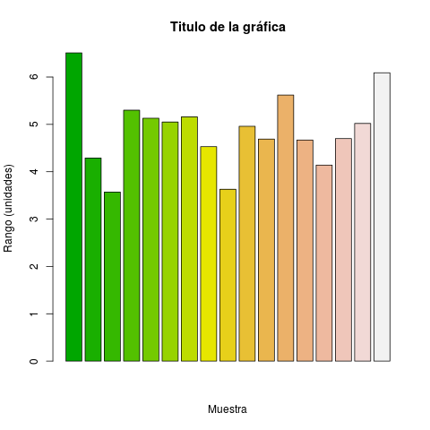
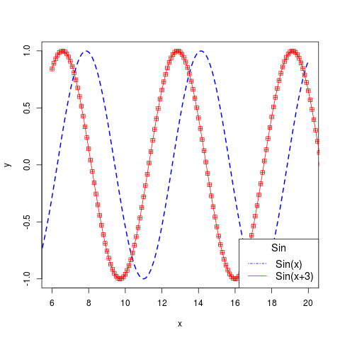

name: inverse
layout: true
class: center, middle, inverse
---
name: Inicio
#Curso de R y microarreglos
[Felipe de J. Muñoz González]

[fmunoz@lcg.unam.mx](mailto:fmunoz@lcg.unam.mx)
.footnote[Vectores y Matrices<br>[Descargar Presentación](http://pipemg.github.io/R_slides/presentacion2.pdf)]
## Descripción de Datos en Estadística
---

layout: false
.left-column[
  ## Manejo de Vectores
   ###  - Creación de vectores
]
.right-column[
<br><br><br><br>
**Vectores** es una variable que contiene más de un valor del mismo tipo (numero, texto, logico, etc.. )

```
> c(1,2,3,4,5)

> c("A","B", "C")

```

Si colocamos valores de diferente tipo, se transformaran en un solo tipo de dato (en general cadena de texto).

```
 > c(1, TRUE, "three")
```
]
---

layout: false
.left-column[
  ## Manejo de Vectores
   ###  - Secuencias de vectores
]
.right-column[

R tiene la posibilidad de generar vectores con secuencias específicas

```
> #numeros del 5 al 10
> 5:10

> #Secuencia del 1 al 20 pasando cada 7 decimas
> seq(from=1,to=20,by=.7)

> #Secuencia de numeros del 90 al 100 en orden inverso
> 100:90

> #Secuencia del 10 al 40 en orden inverso con saltos de 5
> seq(from=40,to=10, by=-5)

> #Letras mayusculas de la A a la F
> LETTERS[1:6]

> #6 letras minusculas
> letters[seq(1,24,6)]

```

]

---

layout: false
.left-column[
  ## Manejo de Vectores
   ###  - Acceso a vectores
]
.right-column[

Los datos dentro de vectores se guardan en una variable y se pueden acceder en el momento que se desee.

```
> vector <- c('este', 'es', 'un', 'vector', 'de', 'texto','pero', 'tiene', 'un', 'numero', '3')

> vector = c('este', 'es', 'un', 'vector', 'de', 'texto','pero', 'tiene', 'un', '3')

```


Accederemos a diferentes elementos del vector

```
> vector[3]

> vector[1:5]

> vector[c(1,4,5,8)]

> vector[11]<-"6"

> vector[length(vector)+1]<-"y"

> vector<-append(vector,c("un","9"))


```
]


---

layout: false
.left-column[
  ## Manejo de Vectores
   ###  - Nombre de vectores
]
.right-column[

Se puede establecer un vector en donde cada elemento del vector contenga un nombre

```
> options(digits=16)
> rango<-rnorm(n=17,mean=5,sd=1)
> rango<-round(rango,2)
> options(digits=3)
> rango<-round(rnorm(n=17,mean=5,sd=1),2)
```
Nombraremos a cada elemento del vector con una letra

```
> names(rango)<-LETTERS[1:17]

> names(rango)<-c("a", "b", "c", "d", "e", "f", "g", "h", "i", "j", "k", "l", "m", "n", "o", "p", "q")
```
]


---
layout: false
.left-column[
  ## Manejo de Vectores
   ###  - Graficar un vector
]
.right-column[


Existen diferentes paquetes para graficar en R, por el momento utilizaremos los del paquete base.

Graficamos un vector en una grafica de barras.

```
> barplot(rango, xlab="Muestra", ylab="Rango (unidades)", main="Titulo de la gráfica")

> barplot(rango, xlab="Muestra", ylab="Rango (unidades)", main="Titulo de la gráfica", col=terrain.colors(17))

> x = seq(1,20,2)
> y = rev(x)
> secuencia<- rep(c(x,y),3)
> barplot(secuencia, col=rep(gray.colors(10),3))
```




]


---

layout: false
.left-column[
  ## Manejo de Vectores
   ###  - Operaciones con vectores
]
.right-column[


La unidad de variables básica en R es el vector, por lo tanto hacer operaciones sobre vectores es sumamente eficiente.

```
> a<-seq(1,20,2)

> a^2

> sqrt(a)


> b <- seq(from=1,by=.5,length.out=10)

> a + b

> a - b

> # Podemos realizar comparaciones
> a == c(1,88,5,7,9,11,23,45,32,19)

> # Buscando diferencias
> a != c(1,88,5,7,9,11,23,45,32,19)

> a < c(1,88,5,7,9,11,23,45,32,19)
```


]


---

layout: false
.left-column[
  ## Manejo de Vectores
   ###  - Graficas de dispersión
]
.right-column[

```
> x <- seq(1, 20, 0.1)
> y <- sin(x)
```

```
> plot(x,y, type="o", lwd=2, col="blue", )

> plot(x,y, type="l", lwd=2, col="blue", lty=2, xlim=c(6,20))

> lines(x+5,y, col="red", type="o", pch=12)

>legend(x="bottomright",legend=c("Sin(x)","Sin(x+3)"), cex=1.2, col=c("blue","red"), lty=c(4,1), title="Sin")

```




]

---

layout: false
.left-column[
  ##  Manejo de Vectores
   ### - Valores NA o NaN
]
.right-column[

<br><br><br><br>


Cuando tenemos datos incompletos veremos en el caso de numeros la señal de **"not available" (NA)** o cuando el tipo de dato no coincida **"Not a Number" (NaN)**. 

```
> a <- c(1, 3, NA, 7, 9)
```

Las operaciones en este caso resultan ser diferentes y la mayoria no se puede utilizar si tenemos valores NA a menos que asi lo indiquemos

```
> sum(a)

> sum(a, rm.na=TRUE)
```

]

---

layout: false
.left-column[
  ## Matrices
   ### - Definicion de matrices
]
.right-column[

<br><br>
Podemos considerar una matriz como un vector de dos dimensiones


```
> mi_matriz<-matrix(data=pi,nrow=3,ncol=4)
```
podemos convertir un vecctor a una matriz

```
> a<-rnorm(n=12,5,.1)

> mi_matriz<-matrix(data=a, nrow=3,ncol=4,byrow=T)
```
para obtener el tamaño de una matriz o definir dimenciones usamos dim


```
> b<-1:8

> dim(b)<-c(4,2)
```
]

---

layout: false
.left-column[
  ## Matrices
   ### - Acceder a una matriz
]
.right-column[

<br><br>
El manejo de matrices es similar al de vectores con la diferencia en el numero de dimensiones

```
> #Imprimimos la matriz b
> print(b)

```
Accedemos a diversos elementos de la matriz b

```
> b[3,1]

> b[,2]

> b[c(1,3),]

```
Podemos modificar los elementos de la matriz

```
> b[2,1]<-0

> b
```

]


---

layout: false
.left-column[
    ## Matrices
   ### - Graficar una matriz
]
.right-column[


Existen diferentes formas de graficar matrices, las más básicas son: graficas de elevación, contorno, perspectiva y mapas de calor

Definimos una matriz de 10 renglones y 10 columnas, con 100 elementos y una distribucion normal con media en 50 y desviacion de 3
```
> elevation <- matrix(rnorm(100,50,3), 10, 10)

> elevation[4, 6] <- 0
```
Graficamos la matriz de diversas maneras

```
> contour(elevation)

> persp(elevation, expand=0.6)

> contour(volcano)

> persp(volcano, expand=0.2)

> image(volcano)
```
]
---

layout: false
.left-column[
    ## Datos estadísticos
   ### - Media, mediana, moda, desviación estandar
]
.right-column[

Existen diferentes numeros en estadística que nos informa de la estructura de nuestros datos, los principales son los siguientes:

```
> a <- round(rnorm(20,10,3))
> names(a)<-LETTERS[1:20]
> #Media/Promedio
> mean(a)

> barplot(a)
> abline(h = mean(a), col="red", lwd=3)

> #Mediana
> median(a)
> abline(h = median(a), col="blue", lty=3, lwd=2)


> # Desviacion
> sd(a)
> abline(h = mean(a)+sd(a), col="green", lwd=2)
> abline(h = mean(a)-sd(a), col="green", lwd=2)
```

Tambien podemos ver un resumen de los datos
```
> # conteo de valores
> table(a)

> # Resumen 
> summary(a)
```
]

---
name: last-page
template: inverse

## That's all folks (for now)!

Slideshow created using [remark](http://github.com/gnab/remark).
