name: inverse
layout: true
class: center, middle, inverse
---
name: Inicio
#Curso de R y microarreglos
[Felipe de J. Muñoz González]

[fmunoz@lcg.unam.mx](mailto:fmunoz@lcg.unam.mx)
.footnote[Introducción a Microarreglos [Descargar Presentación](http://pipemg.github.io/R_slides/presentacion2.pdf)]
## Microarreglos
---

layout: false
.left-column[
  ## Microarreglos
   ###  - Tecnologías de alta eficiencia
]
.right-column[
 
- Las nuevas tecnologías nos permiten analizar multiples genes, proteinas o regniónes del genóma en un solo experimento.

Los microarreglos pueden utilizarse con diferentes objetivos
1. Análisis diferencial de dos o más condiciones (**Class comparations**)
2. Predicción de clases moleculares (**class prediction**)
3. Identificación de subtipos moleculares (**class discovery**)
4. Definición de vias (**Pathway analysis**)

Para cada uno de estos objetivos podemos encontrar diferentes métodos estadísticos:

 - Pruebas para comparación de clases
 - Análisis de discriminación para la predicción de clases
 - Análisis de agrupamiento para el descubrimiento de clases
 - Análisis de enriquecimiento para el análisis de vias.
]
---

layout: false
.left-column[

  ## Microarreglos
   ###  - Clasificación por uso
]
.right-column[
  
Existen diferentes microarreglos, por su uso:
1. Microarreglos de oligonucleótidos de DNA.
2. Microarreglos de variaciónes genómicas (SNPs).
3. Microarreglos de epigenética.
4. Microarreglos de proteinas.
 
Todos utilizan la fluorecencia como indicador de niveles de mRNA, presencia o ausencia de variaciónes genómicas o epigenéticas.

 
Por clasificación en canales:

1. Microarreglos de un canal
2. Microarreglos de dos canales

]

---

layout: false
.left-column[
  ## Bases biológicas
   ###  - ADN, proteinas y el dogma central
]
.right-column[
  
   **Proteina** Secuencia de amino ácidos 
    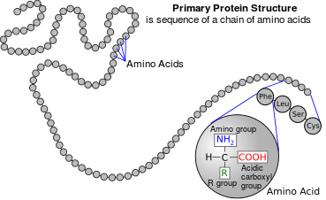 

   Toda la información para producir las proteinas se encuentra almacenada en el **ADN (ácido desoxirribonucleico) ** el cual es una cadena de pequeñas moléculas llamadas **nucleótidos** y en el ADN existen 5 tipos de nucleótidos **Adenosina(A)**, **Citocina(C)**, **Guanina(G)** y **Timina(T)** a las cuales también se les conoce como **bases**.

   EL ADN se puede encontrar en ~Doble cadena~, también conocida como **Doble hélice** o ~Cadena sencilla~. La doble cadena se forma cuando las bases complementarias **A-T** y **G-C** se enlazan quimicamente. 

   
]

---

layout: false
.left-column[
  ## Bases biológicas
   ###  - ADN, proteinas y el dogma central
]
.right-column[
  

    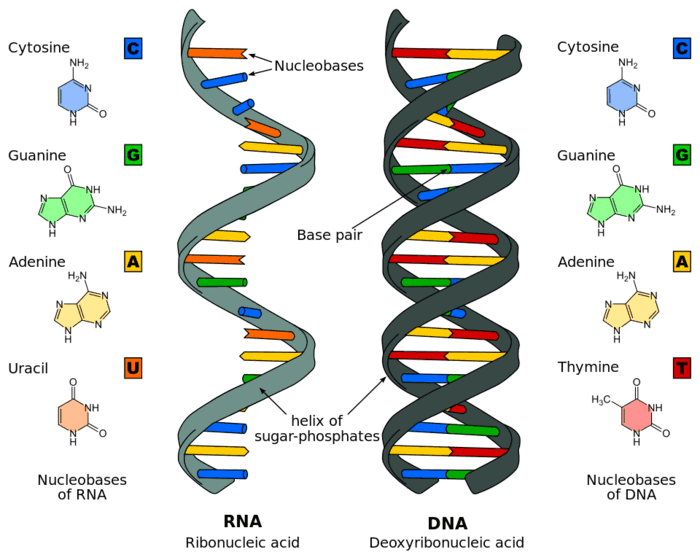 

   EL **ARN (ácido ribonucleico)** es en gran medida igual al ADN pero en lugar de timina contiene un nucleótido similar, el **Uracilo(U)** y solo podemos encontrar ARN en forma de una sola cadena sencilla. Una de las funciones principales del ARN es ser un **intermediario entre el ADN y la proteina**.

   Es común utilizar **polynucleótido** para llamar al ADN o al ARN indistintamente. También hablamos de **cRNA** o **cDNA** cuando nos referimos a una cadena sintetisada estable de ARN o ADN.
]

---

layout: false
.left-column[
  ## Bases biológicas
   ###  - Genes y síntesis de proteinas
]
.right-column[
  
  **Un gen** puede ser definido como un tramo continuo de una molécula de ADN genómico a partir del cual se puede leer información codificada en forma de polynucleótidos de DNA. 

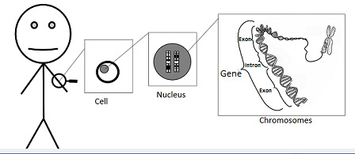 

La relación entre ADN y la secuencia de una proteina se encuentra en el **Dogma central de la biologia molecular**

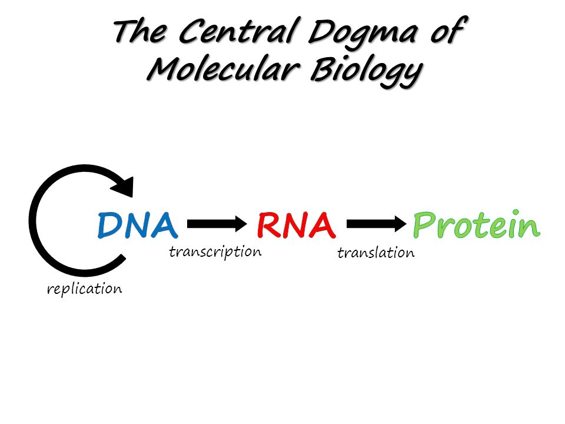 
]

---
layout: false
.left-column[
  ## Bases biológicas
   ###  - Genes y síntesis de proteinas
]
.right-column[

1.En el proceso de **Transcripción** una cadena de ADN es copiada a una cadena complementaria de pre-mARN (o ARN nuclear).

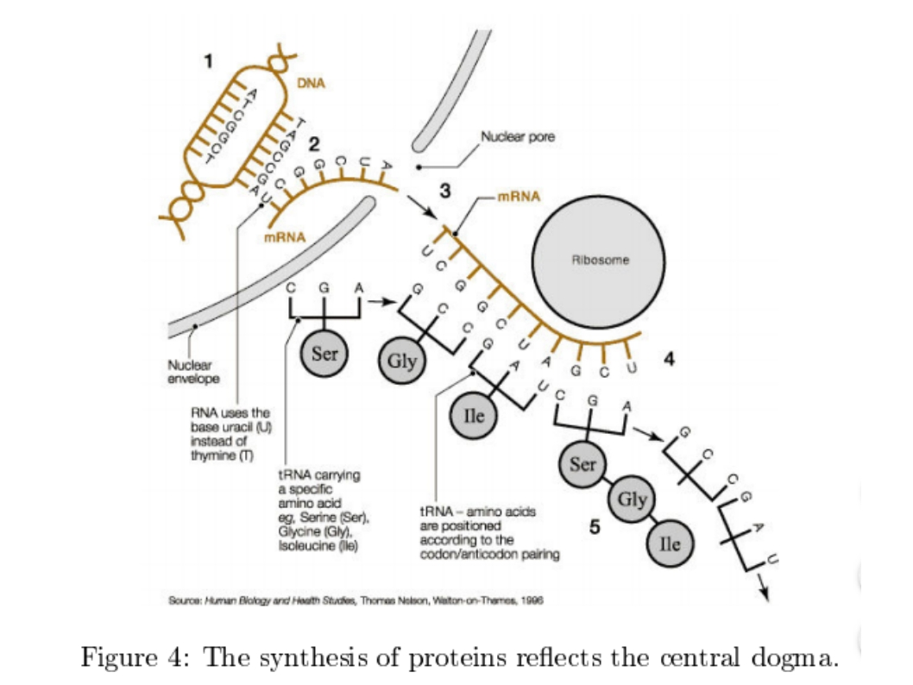

2.En el proceso de **empalme(splicing)** se quitan algunas secciones del pre-mARN llamadas **intrones**. Las secciones restantes se les llaman **exones** y son unidas una tras otra. El resultante es el mARN o ARN mensajero maduro.

]

---

layout: false
.left-column[
  ## Bases biológicas
   ###  - Genes y síntesis de proteinas
]
.right-column[
3.La **traducción** es el proceso de generar proteinas que se encuentran codigicadas en una cadena de mARN. Cada aminoacido se determina basado en tripletes de nuncleotidos llamados **codones**. A esto se le llama **código genético**. Existen 20 aminoacidos y 64 codones asi que hay redundancia. Los encargados de traducir el mRNA a proteina se les conoce como **RNA de transferencia (tRNA)**. 

4.Las proteinas resultantes pueden ser modificadas de forma **post-tarduccional** e.g. agregando un azucar. 

Se solia creer que un 'un gen -una proteina', actualmente se sabe que esto no es así y que existe una gran complejidad en estos procesos.

]

---

layout: false
.left-column[
  ## Bases biológicas
   ###  - Genes y síntesis de proteinas
]
.right-column[
    
Concusión:

**Dado que los genes se expresan transcribiendo y traduciendo su información en ARNm, que luego se utilizará para sintetizar proteínas, si somos capaces de averiguar qué ARNm y qué cantidad hay alrededor, deberíamos poder averiguar qué genes y con qué intensidad se encuentran. siendo expresado**
]
---

layout: false
.left-column[
  ## Bases biológicas
   ###  - Hibridización de ácidos nucleicos
]
.right-column[
    
La **hibridización** es el proceso por el cual dos secuencias en cadena simple de ADN o ARN complementarias se combinan en una molécula. Entre más parecidas sean las secuencias, se uniran más favorablemente. 
Este proceso se ha utilizado por más de 40 años en los ~Southern blot~.
]

---

layout: false
.left-column[
  ##  Microarreglos
   ### - Tecnologia
]
.right-column[
 Los **Microarreglos de DNA** o **Chips de DNA** son herramientas que nos permiten identificar y cuantificar el mARN transcrito en un conjunto de células. De esta forma cuantificar indirectamente el nivel de expresión de un gen. 

Un microarreglo consiste en:
 - Superficie solida de vidrio, plastico y otro material
 - Secuencias de polynucleótidos fijadas llamados **sondas (probs)** 

Existen de dos tipos:
 - **microarreglos de cADN (spotted)**. Las sondas son sintetizadas independientemente y se unen a la superficie mecánicamente. 

 - **Chips de oligonucléotidos**. (Genechip/affimetrix) en donde las sondas son sintetizadas en la superficie. Un gen no es representado por una sonda si no por un conjunto llamado set de sondas o probset. 

]

---

layout: false
.left-column[
  ##  Microarreglos
   ### - Tecnologia
]
.right-column[
  
  Una vez el **mARN es purificado** de las células se procede a sustituir el mRNA por otros nucleotidos que contienen un **fluoróforo**. Después estas moleculas llamdas blancos se depositan en el chip y se coloca en la camara de hibridización. Despúes se lavan y se eliminan los que no pegaron a ninguna sonda.

Se puede realizar de dos maneras:

 - El cADN procede de dos tejidos de interes y se utilizan dos fluoróforos (rojo y verde). La hibridización es en un solo chip (**microarreglos de dos colores**) 
 
 - Hibridización de una muestra por chip. Es cuando se utiliza un solo color de fluoróforo pero se hibridiza una muestra por chip. (**Microarreglos de un color**)
]
---

layout: false
.left-column[
  ##  Microarreglos
   ### - Comparación de chips
]
.right-column[

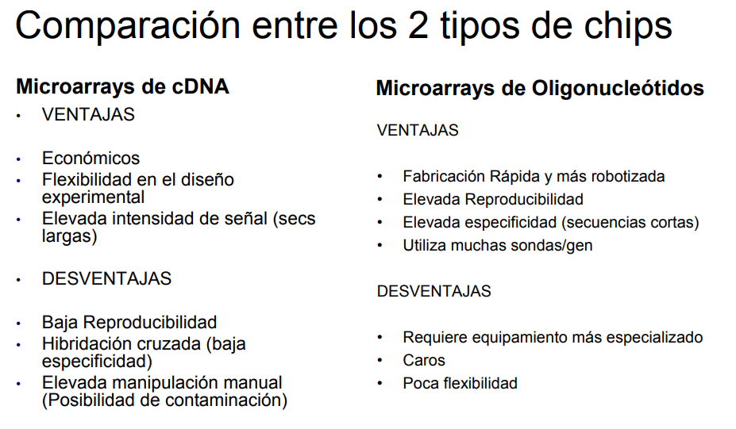
]
---

layout: false
.left-column[
  ##  Microarreglos
   ### - Medición de la expresión
]
.right-column[

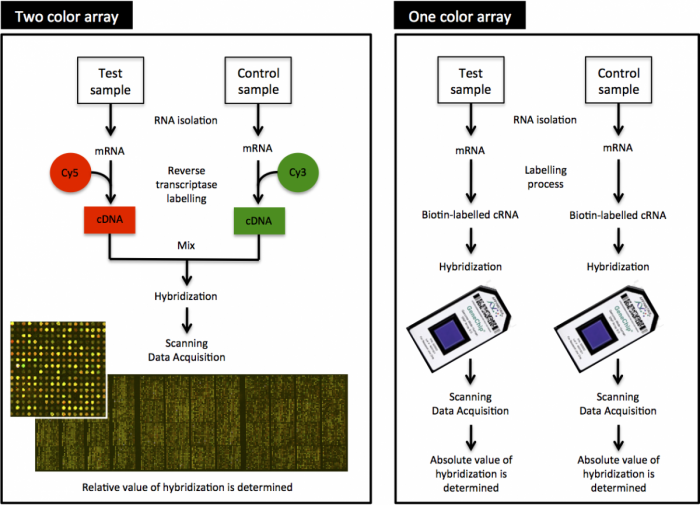

Los microarreglos se cuantifican por la **intensidad de la fluorecencia** que se captura en una imagen (fotografia). La imagen se procesa a una matriz en un proceso computacional que "cuantifica" los microarreglos. 

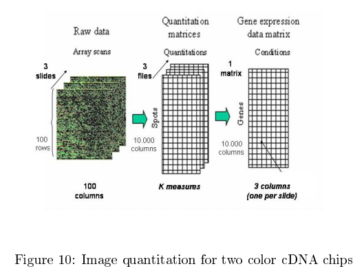
]
---

layout: false
.left-column[
  ##  Microarreglos
   ### - Variabilidad
]
.right-column[

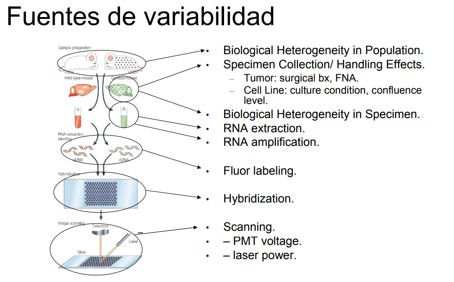

]

---

layout: false
.left-column[
  ##  Microarreglos
   ### - Variabilidad
]
.right-column[

Existen dos tipos de variabilidad en los microarreglos:
 - Sistemática. Aquella que afecta de manera similar a todas las mediciones
   - Cantidad de material disponible
   - Instrumental de laboratorio
 - Aleatoria. Aquella que afecta distintamente cada componente del experimento
   - Cantidad de material
   - Eficiencia de los procedimientos (Estandarización)

]

---

layout: false
.left-column[
  ##  Microarreglos
   ### - Variabilidad
]
.right-column[

Cada tipo de variabilidad se afronta de manera distinta
 - Sistemática
   - Se estima la corrección a partir de una normalización
 - Aleatoria
   - Suponemos modelos de error y recurrimos al **diseño experimental** para controlarla y **inferencia estadística** para extraer conclusiones

Todo esto se integra en el flujo de trabajo o ciclo de vida de un experimento con microarreglos (pipeline)

]

---

layout: false
.left-column[
  ##  Microarreglos
   ### - Pipeline
]
.right-column[

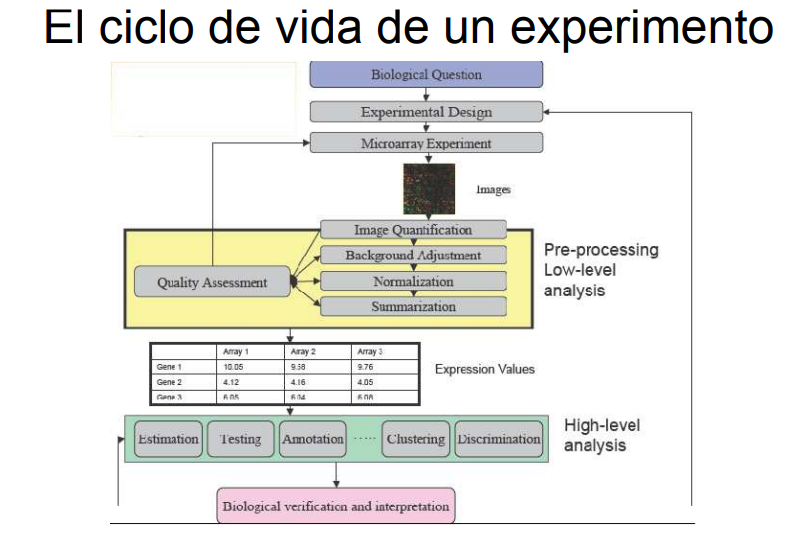

]

---

layout: false
.left-column[
  ##  Microarreglos
   ### - Pipeline
]
.right-column[

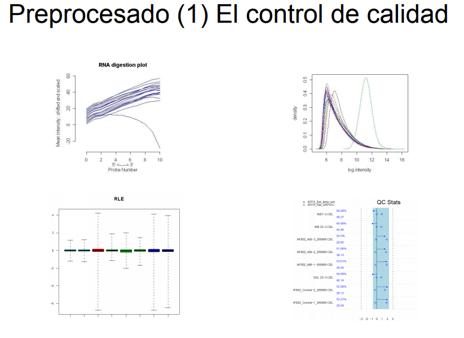

]

---

layout: false
.left-column[
  ##  Microarreglos
   ### - Pipeline
]
.right-column[

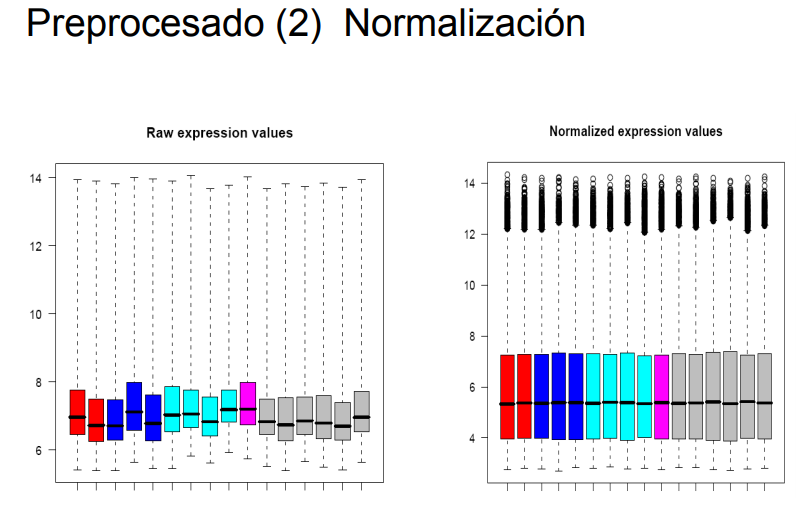

]

---

layout: false
.left-column[
  ##  Microarreglos
   ### - Tipos de análisis
]
.right-column[

Los microarreglos pueden responder distintas preguntas de investigación

 - Encontrar **genes diferencialmente expresados** en dos o más condiciones o a lo largo del tiempo
 - **Identificar subtipos** de una poblacion
 - Definir **Patrones de expresión** caracteristicos
 - **Predecir la respuesta** o **clasificar individuos**
 - **Identificar genes co-regulados** o **co-expresion**

]

---

layout: false
.left-column[
  ##  Microarreglos
   ### - Métodos de análisis
]
.right-column[

Por cada problema existen múltiples métodos

 - **Modelos lineales**, pruebas t-student para expresión diferencial
 - **Análisis de agrupamiento** o conglomerados ("**clustering**") para encontrar patrones de corregulación o coexpresión
 - **Métodos de clasificación** tradicionales (kNN, LDA) y modernos (SVM, PAM) para construir predictores.
 - **Análisis basados en Ontologia de Genes** (GSEA) para buscar significancia biológica

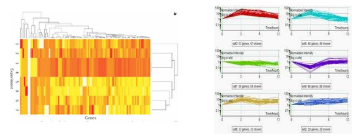

]

---

layout: false
.left-column[
  ##  Microarreglos
   ### - Expresión diferencial
]
.right-column[

- Para comparar dos o más grupos se utilizan extensiones del t-test:
  - El tamaño de muestra suele ser menor que lo que se mide
  - Se compenza estimando la varianza de cada gen a partir de todos los genes
  - SAM, Empirical Bayes

- Por cada gen se hace un test con un problema de multiplicidad
  - Ajustes de multiple testing
  - Estimación de tasa de falsos positivos (FDR) 

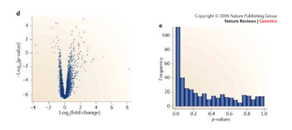
]

---

layout: false
.left-column[
  ##  Microarreglos
   ### - Análisis de conglomerados
]
.right-column[

- Los genes no varian independientemente
- Permite descubrir patrones de expresión
- Puede agrupar muestras por fenotipos similares (Descubrimiento de clases)

]
---

layout: false
.left-column[
  ##  Microarreglos
   ### - Análisis de GO
]
.right-column[

- Los resultados de microarreglos son listas de genes
- Se utilizan los análisis de GO para interpretar los datos
  - Proyectarse en bases de datos como GO o KEGGS
  - Estudiar clases enriquecidas
  - Agrupar genes por similitud funcional

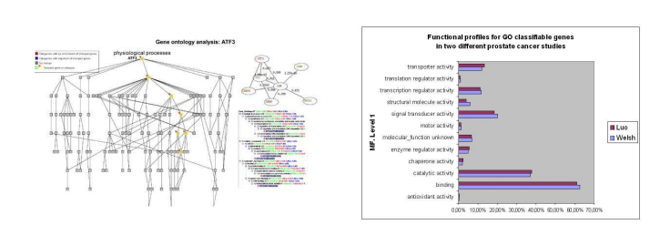
]
---

name: last-page
template: inverse

## That's all folks (for now)!

Slideshow created using [remark](http://github.com/gnab/remark).
