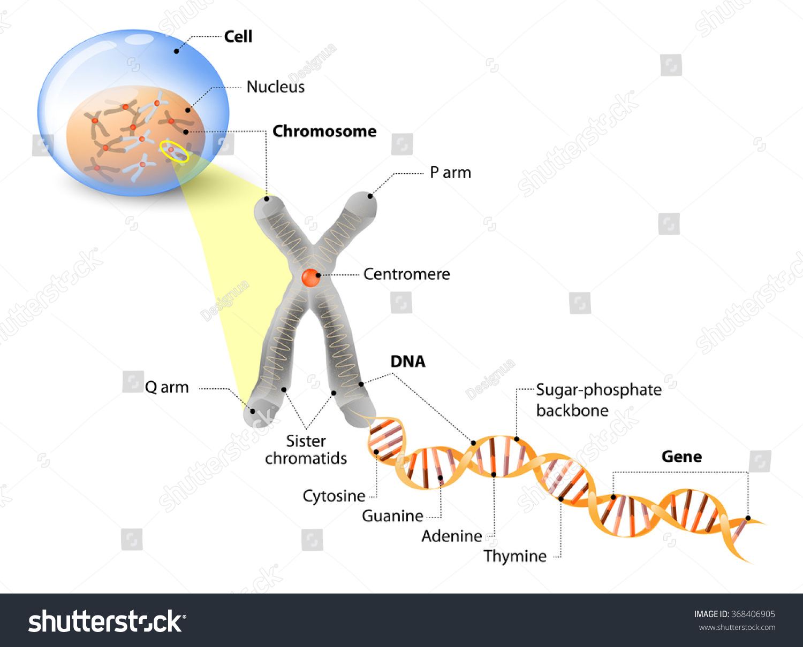

name: inverse
layout: true
class: center, middle, inverse
---
name: Inicio
#Curso de R y microarreglos
[Felipe de J. Muñoz González]

[fmunoz@lcg.unam.mx](mailto:fmunoz@lcg.unam.mx)
.footnote[Introducción a Microarreglos<br>[Descargar Presentación](http://pipemg.github.io/R_slides/presentacion2.pdf)]
## Introducción a Microarreglos
---

layout: false
.left-column[
  ## Introducción a microarreglos
   ###  - Tecnologías de alta eficiencia
]
.right-column[
<br><br><br><br>
- Las nuevas tecnologías nos permiten analizar multiples genes, proteinas o regniónes del genóma en un solo experimento.

Los microarreglos pueden utilizarse con diferentes objetivos
1. Análisis diferencial de dos o más condiciones (Class comparations)
2. Predicción de clases moleculares (class prediction)
3. Identificación de subtipos moleculares (class discovery)
4. Definición de vias (Pathway analysis)

Para cada uno de estos objetivos podemos encontrar diferentes métodos estadísticos:

 - Pruebas para comparación de clases
 - Análisis de discriminación para la predicción de clases
 - Análisis de agrupamiento para el descubrimiento de clases
 - Análisis de enriquecimiento para el análisis de vias.
]
---

layout: false
.left-column[

  ## Introducción a microarreglos
   ###  - Clasificación por uso
]
.right-column[

Existen diferentes microarreglos, por su uso:
1. Microarreglos de oligonucleótidos de DNA.
2. Microarreglos de variaciónes genómicas (SNPs).
3. Microarreglos de epigenética.
4. Microarreglos de proteinas.

Todos utilizan la fluorecencia como indicador de niveles de mRNA, presencia o ausencia de variaciónes genómicas o epigenéticas.
]
---

layout: false
.left-column[
  ## Introducción a microarreglos
   ###  - Clasificación por canales
]
.right-column[
 
Por clasificación en canales:

1. Microarreglos de un canal
2. Microarreglos de dos canales


]

---

layout: false
.left-column[
  ## Bases biológicas
   ###  - ADN, proteinas y el dogma central
]
.right-column[
   **Proteina** Secuencia de amino ácidos 
     

   Toda la información para producir las proteinas se encuentra almacenada en el **ADN (ácido desoxirribonucleico) ** el cual es una cadena de pequeñas moléculas llamadas **nucleótidos** y en el ADN existen 5 tipos de nucleótidos **Adenosina(A)**, **Citocina(C)**, **Guanina(G)** y **Timina(T)** a las cuales también se les conoce como **bases**.

   EL ADN se puede encontrar en ~~Doble cadena~~, también conocida como **Doble hélice** o ~~Cadena sencilla~~. La doble cadena se forma cuando las bases complementarias **A-T** y **G-C** se enlazan quimicamente. 

   EL **ARN (ácido ribonucleico)** es en gran medida igual al ADN pero en lugar de timina contiene un nucleótido similar, el **Uracilo(U)** y solo podemos encontrar ARN en forma de una sola cadena sencilla. Una de las funciones principales del ARN es ser un **intermediario entre el ADN y la proteina**.

   Es común utilizar **polynucleótido** para llamar al ADN o al ARN indistintamente. También hablamos de **cRNA** o **cDNA** cuando nos referimos a una cadena sintetisada estable de ARN o ADN.
]


---

layout: false
.left-column[
  ## Bases biológicas
   ###  - Genes y síntesis de proteinas
]
.right-column[
  **Un gen** puede ser definido como un tramo continuo de una molécula de ADN genómico a partir del cual se puede leer información codificada en forma de polynucleótidos de DNA. 
 

La relación entre ADN y la secuencia de una proteina se encuentra en el **Dogma central de la biologia molecular**

 
]


---
layout: false
.left-column[
  ## Manejo de Vectores
   ###  - Graficar un vector
]
.right-column[


]


---

layout: false
.left-column[
  ## Manejo de Vectores
   ###  - Operaciones con vectores
]
.right-column[


La unidad de variables básica en R es el vector, por lo tanto hacer operaciones sobre vectores es sumamente eficiente.

```
> a<-seq(1,20,2)

> a^2

> sqrt(a)


> b <- seq(from=1,by=.5,length.out=10)

> a + b

> a - b

> # Podemos realizar comparaciones
> a == c(1,88,5,7,9,11,23,45,32,19)

> # Buscando diferencias
> a != c(1,88,5,7,9,11,23,45,32,19)

> a < c(1,88,5,7,9,11,23,45,32,19)
```


]


---

layout: false
.left-column[
  ## Manejo de Vectores
   ###  - Graficas de dispersión
]
.right-column[

```
> x <- seq(1, 20, 0.1)
> y <- sin(x)
```

```
> plot(x,y, type="o", lwd=2, col="blue", )

> plot(x,y, type="l", lwd=2, col="blue", lty=2, xlim=c(6,20))

> lines(x+5,y, col="red", type="o", pch=12)

>legend(x="bottomright",legend=c("Sin(x)","Sin(x+3)"), cex=1.2, col=c("blue","red"), lty=c(4,1), title="Sin")

```


]

---

layout: false
.left-column[
  ##  Manejo de Vectores
   ### - Valores NA o NaN
]
.right-column[

<br><br><br><br>


Cuando tenemos datos incompletos veremos en el caso de numeros la señal de **"not available" (NA)** o cuando el tipo de dato no coincida **"Not a Number" (NaN)**. 

```
> a <- c(1, 3, NA, 7, 9)
```

Las operaciones en este caso resultan ser diferentes y la mayoria no se puede utilizar si tenemos valores NA a menos que asi lo indiquemos

```
> sum(a)

> sum(a, rm.na=TRUE)
```

]

---

layout: false
.left-column[
  ## Matrices
   ### - Definicion de matrices
]
.right-column[

<br><br>
Podemos considerar una matriz como un vector de dos dimensiones


```
> mi_matriz<-matrix(data=pi,nrow=3,ncol=4)
```
podemos convertir un vecctor a una matriz

```
> a<-rnorm(n=12,5,.1)

> mi_matriz<-matrix(data=a, nrow=3,ncol=4,byrow=T)
```
para obtener el tamaño de una matriz o definir dimenciones usamos dim


```
> b<-1:8

> dim(b)<-c(4,2)
```
]

---

layout: false
.left-column[
  ## Matrices
   ### - Acceder a una matriz
]
.right-column[

<br><br>
El manejo de matrices es similar al de vectores con la diferencia en el numero de dimensiones

```
> #Imprimimos la matriz b
> print(b)

```
Accedemos a diversos elementos de la matriz b

```
> b[3,1]

> b[,2]

> b[c(1,3),]

```
Podemos modificar los elementos de la matriz

```
> b[2,1]<-0

> b
```

]


---

layout: false
.left-column[
    ## Matrices
   ### - Graficar una matriz
]
.right-column[


Existen diferentes formas de graficar matrices, las más básicas son: graficas de elevación, contorno, perspectiva y mapas de calor

Definimos una matriz de 10 renglones y 10 columnas, con 100 elementos y una distribucion normal con media en 50 y desviacion de 3
```
> elevation <- matrix(rnorm(100,50,3), 10, 10)

> elevation[4, 6] <- 0
```
Graficamos la matriz de diversas maneras

```
> contour(elevation)

> persp(elevation, expand=0.6)

> contour(volcano)

> persp(volcano, expand=0.2)

> image(volcano)
```
]
---

layout: false
.left-column[
    ## Datos estadísticos
   ### - Media, mediana, moda, desviación estandar
]
.right-column[

Existen diferentes numeros en estadística que nos informa de la estructura de nuestros datos, los principales son los siguientes:

```
> a <- round(rnorm(20,10,3))
> names(a)<-LETTERS[1:20]
> #Media/Promedio
> mean(a)

> barplot(a)
> abline(h = mean(a), col="red", lwd=3)

> #Mediana
> median(a)
> abline(h = median(a), col="blue", lty=3, lwd=2)


> # Desviacion
> sd(a)
> abline(h = mean(a)+sd(a), col="green", lwd=2)
> abline(h = mean(a)-sd(a), col="green", lwd=2)
```

Tambien podemos ver un resumen de los datos
```
> # conteo de valores
> table(a)

> # Resumen 
> summary(a)
```
]

---
name: last-page
template: inverse

## That's all folks (for now)!

Slideshow created using [remark](http://github.com/gnab/remark).
