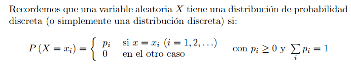

name: inverse
layout: true
class: center, middle, inverse
---
name: Inicio
#Curso de R y estadística básica
[Felipe de J. Muñoz González]

[fmunoz@lcg.unam.mx](mailto:fmunoz@lcg.unam.mx)
.footnote[Distribuciones discretas<br>[Descargar Presentación](http://pipemg.github.io/R_slides/presentacion3.pdf)]
---
## Variables Aleatorias Discretas
---

layout: false
.left-column[
  ## Variables Aleatorias Discretas
   ### - Funciones de Probabilidad

]
.right-column[
<br><br><br><br>
Para toda variable discreta X se asocia una función de probabilidad fX :
S_X → [0, 1] definida como:

f_X(x) = P(X = x), x ∈ S_X. 

y cumplen las siguientes caracteristicas

1. f_X(x)>0 para todo x ∈ S

2. Sum(x∈S, f_X(x)) = 1

3. P(X ∈ A) = Sum(x∈A, f_X(x)) para todo A ⊂ S

]
---

layout: false
.left-column[
  ## Variables Aleatorias Discretas
   ### - Funciones de Probabilidad
   ### - Media, Varianza y SD

]
.right-column[
<br><br><br>

Media o Esperanza

µ = E(X) = sum(x*f_X(x)), donde x ∈ S 


Varianza

σ^2 = SUM[(x − µ)^2 * f_X(x)],  donde x ∈ S 


SD

σ = sqrt(σ^2)

<br>
Ejemplo


<table border=1px align="center">
<tr align="center"><th> x∈ S</th><td> 0 </td><td> 1 </td><td> 2 </td><td> 3 </td></tr>
 
<tr align="center"  margin=10px><th> f_X(x) = P(X = x)  </th><td> 1/8 </td><td>  3/8 </td><td>   3/8 </td><td>   1/8 </td></tr>
</table>

]

---


layout: false
.left-column[
  ## Variables Aleatorias Discretas
   ### - Funciones de Probabilidad
   ### - Ejemplo

]
.right-column[


Definimos el problema

```
> x <- c(0,1,2,3)
> f <- c(1/8, 3/8, 3/8, 1/8)

```
Calculamos la media

```
> mu <- sum(x * f)
> mu

```


Calculamos la varianza

```
> sigma2 <- sum((x-mu)^2 * f)
> sigma2
```

Calculamos la desviación estandar

```
> sigma2 <- sum((x-mu)^2 * f)
> sigma2
```


Calculamos las sumas acomulativas

```
> F = cumsum(f)
> F
```


]

---

layout: false
.left-column[
  ## Variables Aleatorias Discretas
   ### - Funciones de Probabilidad
   ### - Paquete distEx

]
.right-column[
<br><br><br><br>
```
> install.packages("distrEx")
> library(distrEx)
> X <- DiscreteDistribution(supp = 0:3, prob = c(1,3,3,1)/8)
> E(X); var(X); sd(X)

```

<br><br>
```
> mu <- sum(x * f)
> mu

```
]

---
template: inverse
## Distribución Uniforme Discreta
---


layout: false
.left-column[
  ## Distribución Uniforme Discreta
   ### - Funcion de Probabilidad

]
.right-column[
<br><br><br><br>
Para una variable aleatoria X con una distribución discreta 1,2,3,...,m la función de probabilidad es:

f_X(x) = 1/m  donde x = 1, 2, . . . , m

o

X ∼ disunif(m)

Un experimento aleatorio donde esta distribución ocurre es el elegir un numero entero entre 1 y 100, sea X el numero escogido entonces:

 X ∼ disunif(m = 100)


y 

P(X=x) = 1/100, x=1,...100
]

---


layout: false
.left-column[
  ## Distribución Uniforme Discreta
   ### - Media, Varianza y desviación 

]
.right-column[
<br><br><br><br>

Media

<code>
µ = Sum_1^m (x*f_X(x))  = Sum_1^m(x*(1/m) ) 

µ = (1/m) * (1+2+3+...+m)    = (m+1)/2
</code>

Varianza

<code>
Sum_1^m (x^2 * f_X(x))  = (1/m)Sum_1^m(x^2)  = (m+1)(2m+1)/6

σ^2 = Sum_1^m (x^2 * f_X(x))  - µ^2 = (m+1)(2m+1)/6 - ((m+1)/2)^2 =...= (m^2-1)/12
</code>

Desviación

<code>
σ = sqrt( (m^2-1)/12)
</code>

]


---
layout: false
.left-column[
  ## Distribución Uniforme Discreta
   ### - Media, Varianza y desviación 

]
.right-column[
<br><br><br><br>

Para simular una distribución aleatoria uniforme utilizamos la función 

```
> ?sample
```


Ejemplos

- Tira un dado 3000 veces

```
> sample(6, size = 3000, replace = TRUE).

```

- Seleccionar un numero aleatorio entre 30 y 70

```
> sample(30:70, size = 27, replace= TRUE)

```


- Tirar una moneda 1000 veces

```
> sample(c("A","S"), size = 1000, replace = TRUE)

```


]


---
template: inverse
## Distribución Binomial
---


layout: false
.left-column[
  ## Distribución Binomial
   ### - Ensayo de Bernulli

]
.right-column[
<br><br><br><br>

Esta distribución se basa en un ensayo de Bernulli (donde solamente hay dos posibles resultados, Exito (True) y Fracaso (Falso). 

sea X la variable aleatoria, X = 1 si el suceso tiene exito y X = 0 si no lo tiene.

La probabilidad del suceso se define como p y el fracaso como 1-p=q 

La función de probabilidad esta definida como:

f_X(x) = p^x (1-p)^(1-x) donde x={0,1}


Es facil calcular la media, varianza y desviación


µ = E(X) = p

E(X^2) = p

σ^2 = p − p^2 = p(1 − p).

]

---


layout: false
.left-column[
  ## Distribución Binomial
   ### - Modelo binomial

]
.right-column[
<br><br><br><br>

Contienen 3 caracteristicas:

 - Se realizan n pruebas de bernulli

 - Las pruebas son **independientes**

 - La probabilidad p es constante

Si X considera el numero de exitos en n experimentos, entonces la función de probabilidad es:

f_X(x) = Conv(n,x)*p^x*(1-p)^(n-x)  para x=0,1,2,3,...,n

Decimos que X tiene una distribucion binomial y se escribe e X ∼ binom(size = n, prob = p). 


]


---


layout: false
.left-column[
  ## Distribución Binomial
   ### - Modelo binomial
   ### - Media, Varianza y Desviación

]
.right-column[
<br><br><br><br>

Media

µ = SUM_0^n (x*Conv(n,x) * p^x * (1-p)^(n-x))

µ = SUM_1_n (x* (n!/(x!(n-x!))) * p^(x-1) * q^(n-x))

µ = np

De modo similar, obtenemos la varianza


σ^2 = E(X(X − 1)) + E(X) − [E(X)]^2

]

---


layout: false
.left-column[
  ## Distribución Binomial
   ### - Modelo binomial
   ### - Media, Varianza y Desviación

]
.right-column[
<br><br><br><br>

Media

µ = SUM_0^n (x*Conv(n,x) * p^x * (1-p)^(n-x))

µ = SUM_1_n (x* (n!/(x!(n-x!))) * p^(x-1) * q^(n-x))

µ = np

De modo similar, obtenemos la varianza


σ^2 = E(X(X − 1)) + E(X) − [E(X)]^2

]


---


layout: false
.left-column[
  ## Distribución Binomial
   ### - Modelo binomial
   ### - Ejemplo

]
.right-column[
<br><br><br><br>

Ejemplo.

Una familia de 4 hijos. Cada hijo solo puede ser Hombre o Mujer, las probabilidades de que sea uno u otro son 1/2 y los eventos son independientes. Si decimos que X es el numero de hombres entonces 
X ∼ binom(size = 4, prob = 1/2).

por lo tanto

f_X(2)=Conv(4,2)*(1/2)^2*(1/2)^2= 6/2^4

la media del numero de hombres es 4(1/2) = 2 y la varianza de X es de 4(1/2)(1/2) =1


]


---


layout: false
.left-column[
  ## Distribución Binomial
   ### - Modelo binomial
   ### - Ejemplo

]
.right-column[
<br><br><br><br>


```
?pbinom
```

Tirar 12 dados al mismo tiempo y definimos X como el numero de 6's que aparacen. Nosotros queremos obtener la probabilidad de obtener 7,8 o 9 6's.

S={salir 6 en un dado}

P(S) = 1/6


X ∼ binom(size =12, prob =1/6)


P(7 ≤ X ≤ 9) =SUM_{X=7}^{X=9} Conv(12,x)*(1/6)^x *(5/6)^(12-x)


```
> pbinom(9, size=12, prob=1/6) - pbinom(6, size=12, prob=1/6)
```

```
> diff(pbinom(c(6,9), size = 12, prob = 1/6)) # same thing
```

]


---


layout: false
.left-column[
  ## Paquete distr

]
.right-column[
<br><br><br><br>


```
> install.packages("distr")
```

```
> library(distr)
> X <- Binom(size = 3, prob = 1/2)
> X
```

```
> d(X)(1) # pmf of X evaluated at x = 1

> p(X)(2) # cdf of X evaluated at x = 2

```


]

---


layout: false
.left-column[
  ##  Distribuciones Discretas
   ### Resumen

]
.right-column[
<br><br><br><br>

* Distribución de bernoulli


* Distribución binomial


* Distribución binomial negativa


* Distribución Hipergeométrica


* Distribución de poisson

]


---


layout: false
.left-column[
  ##  Distribuciones Discretas
   ### Introducción

]
.right-column[
<br><br><br><br>


]


---

name: last-page
template: inverse

## That's all folks (for now)!

Slideshow created using [remark](http://github.com/gnab/remark).
