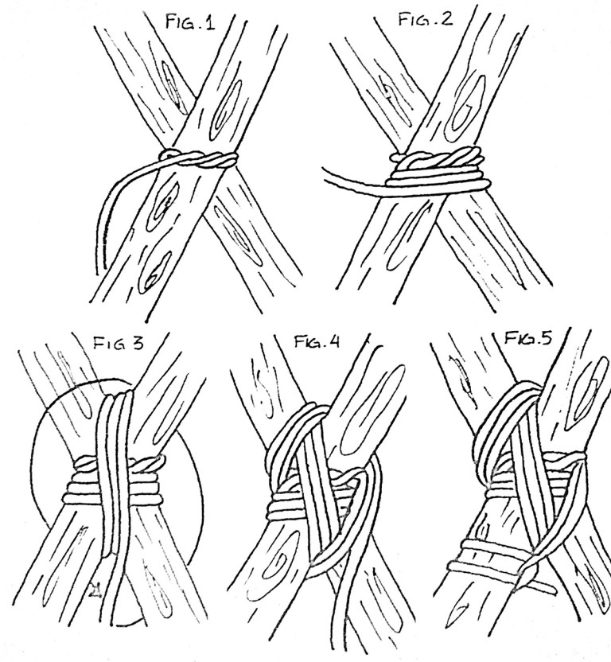
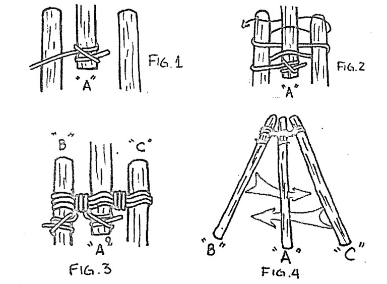

#Amarres

## Amarre Redondo

### Para que sirve

Este amarre se usa para prolongación de un madero o un mástil.

### Como se hace

**Primera versión**

1.- Se hace un nudo de eslinga o boca de lobo alrededor de los dos troncos y en la parte media donde se cruzan ambos
2.- En casa extremo se rodean los troncos apretando fuertemente
3.- Luego se ahorca el amarre con tres vueltas de forma cruzada y se termina el amarre con un ballestrinque.

**Segunda versión**

1.- Se hace un seno apoyándolo sobre la parte común  ambos troncos
2.- Se comienza a dar vueltas hasta cubrir casi en forma total la longitud del seno
3.- Luego se introduce el chicote por el seno y se tira desde el firme que quedo pisado con las vueltas anteriores

## Amarre Cuadrado

### Para que sirve

Este amarre se usa para unir dos troncos cruzados en ángulo recto o casi recto y cuando con el esfuerzo aplicado, tienden a deslizarse uno sobre otro.

### Como se hace

1.- Se realiza un ballestrinque sobre el tronco que se encuentra afirmado
2.- Se pasa la cuerda por delante del tronco horizontal (soportado) y por detrás del soporte
3.- Se vuelve a pasar la cuerda por delante del tronco soportado y por detrás del vertical, repitiendo esta operación por lo menos tres veces más, cuidando que en cada vuelta la cuerda pase por dentro de las anteriores sobre el tronco horizontal y por fuera del tronco vertical
4.- Luego se ahorca e amarre dando tres vueltas de forma cruzada entre el tronco de soporte y el soportado
5.- Se hace un ballestrinque para terminar el amarre

## Amarre Diagonal

### Para que sirve

Se usa este amarre para unir dos troncos que forman un ángulo muy cerrado a diferencia del amarre cuadrado que se usa con ángulos rectos.

### Como se hace

1. Se hace un nudo de leñador alrededor de los dos troncos cuzados
2. Dar por lo menos tres vueltas siguiendo la dirección del nudo leñador
3. Se dan tres vueltas de forma cruzada a las vueltas anteriores
4. Ahorcar el amarre dando por lo menos tres vueltas de forma cruzada de las vueltas anteriores
5. Termina el amarre con un ballestrinque

## Amarre de tripie/trípode

### Para que sirve

Sirve para hacer una construcción que servirá de base para otras construcciones, para hacer refugios, mástiles, cocinas, etc…

### Como se hace

1. Se ubican los troncos de manera que el tronco central quede en dirección opuesta a los otros dos
2. Hacer un ballestrinque sobre el tronco central cuidando no hacerlo muy cerca del borde para evitar que se salga
3. Se abraza los tres troncos ajustándolos con la cuerda por arriba y por abajo de forma que queden entrelazados
4. Se ahorca el amarre por la unión de los dos troncos y después se ahorcan los otros dos y se termina el amarre con un ballestrinque
5. Al momento de levantar esta construcción se cruzan entre si de forma que vayan ajustándose
6. Es recomendable enterrar los troncos para evitar que la construcción se corra o también utilizar maderos haciendo un marco amarrándolos al rededor de la construcción

 

 

