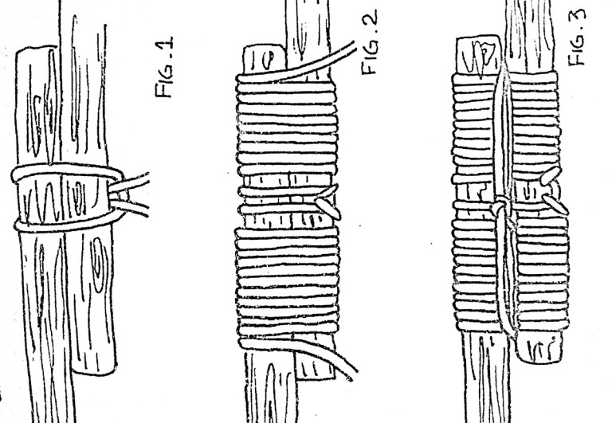
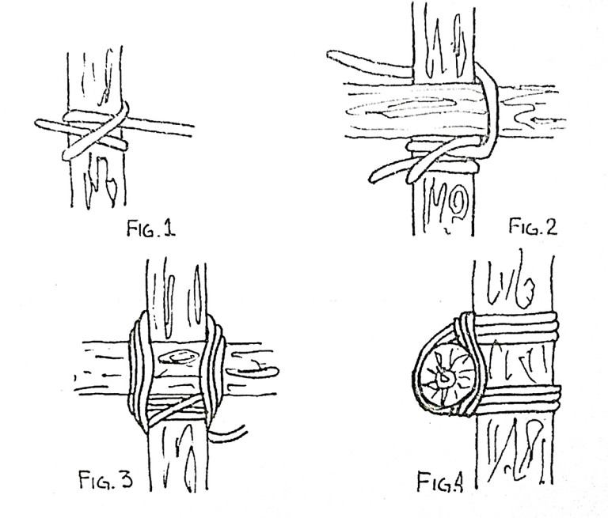

#Amarres

## Amarre Redondo

### Para que sirve

Este amarre se usa para prolongación de un madero o un mástil.

### Como se hace

**Primera versión**

1.- Se hace un nudo de eslinga o boca de lobo alrededor de los dos troncos y en la parte media donde se cruzan ambos
2.- En casa extremo se rodean los troncos apretando fuertemente
3.- Luego se ahorca el amarre con tres vueltas de forma cruzada y se termina el amarre con un ballestrinque.

**Segunda versión**

1.- Se hace un seno apoyándolo sobre la parte común  ambos troncos
2.- Se comienza a dar vueltas hasta cubrir casi en forma total la longitud del seno
3.- Luego se introduce el chicote por el seno y se tira desde el firme que quedo pisado con las vueltas anteriores

## Amarre Cuadrado

### Para que sirve

Este amarre se usa para unir dos troncos cruzados en ángulo recto o casi recto y cuando con el esfuerzo aplicado, tienden a deslizarse uno sobre otro.

### Como se hace

1.- Se realiza un ballestrinque sobre el tronco que se encuentra afirmado
2.- Se pasa la cuerda por delante del tronco horizontal (soportado) y por detrás del soporte
3.- Se vuelve a pasar la cuerda por delante del tronco soportado y por detrás del vertical, repitiendo esta operación por lo menos tres veces más, cuidando que en cada vuelta la cuerda pase por dentro de las anteriores sobre el tronco horizontal y por fuera del tronco vertical
4.- Luego se ahorca e amarre dando tres vueltas de forma cruzada entre el tronco de soporte y el soportado
5.- Se hace un ballestrinque para terminar el amarre

