# Nudos

## Nudo de trebol

### Para que sirve

Se utiliza para afirmar un mástil mediante tres vientos,  para elevar plataformas cuadras y bultos de la misma forma

### Como se hace

1. Se hace un nudo simple sin ajustar
2. Se hace un seno hacia arriba y luego otro nudo simple entrelazado con el anterior
3. Se toman los extremos inferiores de los nudos simples y se hala hacia afuera ajustando

 

[Video_nudo_trebol]()

## Silla de Bombero

### Para que sirve

Su utilidad es similar a la del as de guia doble pero con la ventaja del tiempo y facilidad de ejecución,  se utiliza tambien en salvataje y transporte de carga.

### Como se hace

1. Se realizan dos gazas entrelazadas como si fuera un ballestrinque
2. Tomar la parte central entrelazada de las gazas y halar hacia los lados de forma inversa para crear dos senos
3. Hacer una gaza a cada uno de los costados, introducir los senos por la gaza y ajustar

 

[Video_nudo_silla_de_bombero](https://www.youtube.com/watch?time_continue=1&v=uCFruu956TA)

## Nudo tensor

### Para que sirve

Nudo de fijación que sirve para tensar una cuerda y tiene como ventaja su facilidad para volver a ajustar en caso de ser necesario.

### Como se hace

1. Se hacen dos nudos sobre el firme a una separación de dos centímetros sin ajustarlos
2. Con el chicote se da una vuelta sobre el tronco o base
3. Se inserta el chicote sobre los dos nudos realizados anteriormente en el firme de manera que se regrese hacia el tronco
4. Se hala desde el chicote haciendo que se tense la cuerda y cada vez que necesite ser tensada de nuevo solo se vuelve a ajustar desde el chicote

 

[Video_nudo_tensor](https://www.youtube.com/watch?v=Sang_kRsAco)

## Presilla de alondra o boca de lobo

### Para que sirve

El nudo Presilla de Alondra es muy útil para sujetar un tronco a una cuerda de forma temporal, siempre y cuando se consiga una fuerte presión sobre él, también puede ser utilizado para atar la soga a un gancho o a una argolla.

### Como se hace

1. Se pasa el chicote abrazando el tronco o la argolla
2. Se cruza el chicote sobre el firme
3. Se regresa el chicote por la gaza formada anteriormente

 

[Video_nudo_trebolpersilla_de_alondra](https://www.youtube.com/watch?v=R3N38kEYOx0)

## Vuelta de escota

### Para que sirve

Es uno de los nudos de unión de gran utilidad, muy similar a un nudo de rizo con la diferencia que este sirve para unir cabos de distintos anchos (diferente mena). Este nudo también puede mejorarse haciéndose pasar dos vueltas sobre el bucle en lugar de una, justo antes de morder el chicote. A esta modificación se le llama “doble vuelta de escota”. Así logramos aumentar la seguridad del nudo cuando esté sometido a fuerzas durante largos periodos de tiempo.

### Como se hace

1. Con el seno de uno de los cabos se forma un bucle a modo de gaza.
2. Se pasa el chicote del otro cabo por dentro de la gaza, se le da vuelta y se pasa el chicote por debajo del firme para que quede mordido o aplastado por él.

 

[Video Vuelta de Escota]()

## Nudo de ocho

### Para que sirve

Nudo de tope o peso, se utiliza para evitar que los cabos se salgan de las poleas, como finalización de cuerda e incluso para improvisar escaleras. Tiene una gran ventaja sobre el medio nudo, y es que, aunque sufra tensión, se afloja con facilidad.

### Como se hace

1. Se hace una gaza
2. Se monta el chicote por encima del firme
3. Luego se introduce el chicote por la parte de abajo de la gaza

 

[Video Ocho Simple](https://www.youtube.com/watch?v=lUBsyGRf4pM)

##  As de guía doble

### Para que sirve

El **as de guía doble** es un nudo muy utilizado en tareas de rescate marítimo. Se trata de un nudo muy seguro el cual proporciona dos lazos que tienen el mismo diámetro, los cuales pueden utilizarse de forma independiente y no se deshacen.En el caso de un rescate marítimo, el as de guía doble permite a la persona que se tiene que rescatar que pueda colocar una gaza a través de cada pierna y que pueda sujetarse al firme, facilitando de esta forma el rescate.

### Como se hace

1. Haremos una primera gaza que quede hacia adentro dejando aproximadamente dos metros de cuerda del lado del chicote.
2. El chicote pasará de abajo hacia arriba por la gaza.
3. El chicote dará la vuelta por el firme de la cuerda.
4. Regresar la cuerda por la misma gaza pasando el chicote de arriba hacia abajo.
5. Con el sobrante de cuerda del chicote dar una vuelta mas y seguir el nudo sobre la gaza anterior.
6. Si este nudo se hace en la cintura, debe quedar a la altura de la cadera y a unos 4 dedos de separación del cuerpo.

 
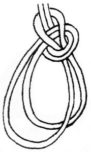

[As de guia doble]()

##  Nudo alpinista o de centro

### Para que sirve

Se usa para hacer una gaza en el centro de una cuerda sin tener los extremos libres.

### Como se hace

1. Se hacen dos gazas para el mismo lado
2. Se agarra en seno que queda en la parte inferior y se pasa por el medio de las dos gazas anteriores
3. Se tira quedando dos nudos simples que se ajusta uno debajo del otro

 
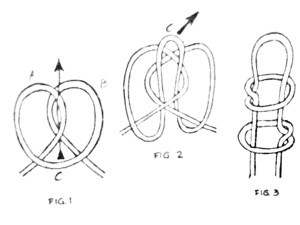

[Nudo alpinista o de centro]()

##  Media llave y dos cotes

### Para que sirve

Nudo de fijación. Sirve para sujetar una cuerda a un tronco o una argolla, cuando esta estará en tensión. La principal ventaja de este nudo es su facilidad para hacerlo y deshacerlo.

### Como se hace

1. Se da una vuelta completa alrededor del madero o argolla
2. El chicote se lo introduce por la vuelta generada y se ajusta el nudo
3. Siguiendo en la misma dirección se hace un cote sobre el firme

 
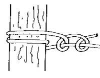

[Media llave y dos cotes](https://www.youtube.com/watch?v=2gYd5t5tXt0)

##  Arnés de hombre

### Para que sirve

Este nudo sirve para hacer una gaza en medio de la cuerda cuando no se tienen disponibles los chicotes.

### Como se hace

1. Se hace una gaza y se cruza sobre el firme
2. Se toma la parte inferior de esta gaza formando un seno y se hala hacia arriba por donde se cruza la gaza con el firme
3. Apretar el nudo cuidando que el seno creado en la parte superior tenga suficiente espacio para asegurar un mosqueton o enganchar otra cuerda
 
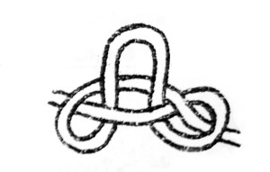

[Arnés de hombre](https://www.youtube.com/watch?v=pyaX8xOUu6A)

##  Ballestrinque doble

### Para que sirve

Es una modificación del nudo ballestrinque que se caracteriza por una mejora notable de su seguridad. El ballestrinque doble es un nudo facily de realizar y se deshace con facilidad convirtiéndolo en un nudo excelente en muchas situaciones distintas.

### Como se hace

1. En primer lugar, debes rodear el área donde quieras hacer el nudo con la cuerda, dando una vuelta por encima y el chicote abajo.
2. Seguidamente debes dar otra vuelta, en el mismo sentido, con el chicote por encima de la anterior.
3. Finalmente debes introducir el chicote por dentro del seno que se ha formado al dar la segunda vuelta, por encima del firme.
4. Puedes hacer un lazo de seguridad sobre el mismo cabo, para evitar que se suelte.
 
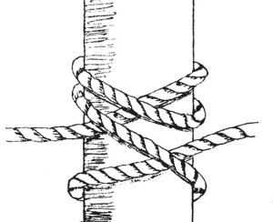

[Ballestrinque doble]()

## Margarita

### Para que sirve

Nudo de acorte que se utiliza para reducir la longitud de una cuerda muy larga sin necesidad de cortarla. Otro uso que le damos a este nudo es cómo refuerzo para cuerdas gastadas, situando siempre el tramo gastado en el interior del nudo.

### Como se hace

1. Adujar la cuerda (recojer en aros), mínimo 3 aros
2. Se hace una gaza y se asegura uno de los extremos de la cuerda
3. En el otro extremo se hace otra gaza que asegure el otro extremo
4. Se ajusta cuidando de que las gazas agarren los extremos lo suficiente para que no se salgan de los extremos

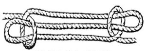

[Margarita](https://www.youtube.com/watch?time_continue=24&v=mpb-lCmrCP8)

## Pescador

### Para que sirve

Se usa para unir dos cuerdas que por su fabricación sean muy resbaladizas o, para unir dos cuerdas que se meterán al agua, que la cuerda esté mojada o en cabos gruesos difíciles de entrelazar o también si es necesario que ambas cuerdas se deslicen una sobre otra. Es fácil de hacer y de deshacer, aun cuando las cuerdas estén mojadas.Si las cuerdas se van a mantener bajo el agua, es recomendable hacer dobles las vueltas o en cada extremo, para asegurar mejor el nudo.

### Como se hace

1. Se hacen dos nudos simples a cada extremo de la cuerda y luego se deslizan hacia el centro.

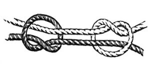

[Pescador]()

## Leñador o Vuelta de Braza

### Para que sirve

El nudo de leñador ambien es conocido cómo vuelta de braza o nudo de estribo. Su nombre proviene del uso que le daban los leñadores para arrastrar los troncos por el suelo. Es un nudo de amarre provisional que lo usaremos para amarrar cualquier objeto, cómo por ejemplo troncos, paquetes, tablones o objetos que deseemos transportar. También podemos usarlo para operaciones de rescate, siempre que lo amarremos a un lugar seguro.

### Como se hace

1. En primer lugar, debes rodear el área donde quieras hacer el nudo con la cuerda, dando una vuelta por encima y el chicote abajo.
2. Se regresa el chicote por el firme en la misma dirección de donde se empezó la vuelta.
3. Se dan mínimo 3 vueltas en la misma dirección de regreso del chicote y se ajusta.

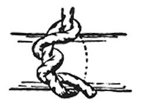

[Leñador o Vuelta de Braza]()

## As de guía

### Para que sirve

El nudo As de Guía es sin duda un de los más utilizados en un barco. Forma una gaza fija en el chicote de un cabo con la ventaja de no escurrirse, de ser muy seguro y de deshacerse fácilmente a pesar de haber estado sufriendo una fuerte carga de trabajo, puede ser muy adecuado para afirmar las drizas o escotas a las velas, para encapillar en un noray a las amarras, para izar una persona o como cabo de seguridad si carecemos del arnés adecuado.

### Como se hace

1. Haremos una primera gaza que quede hacia adentro.
2. El chicote pasará de abajo hacia arriba por la gaza.
3. El chicote dará la vuelta por el firme de la cuerda.
4. Regresar la cuerda por la misma gaza pasando el chicote de arriba hacia abajo y ajustar.
5. Si este nudo se hace en la cintura, debe quedar a la altura de la cadera y a unos 4 dedos de separación del cuerpo.

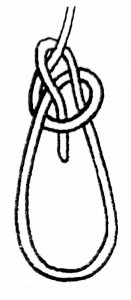

[As de guía](https://www.youtube.com/watch?time_continue=1&v=yLxisOKD2ho)

## Nudo de ballestrinque

### Para que sirve

Nudo de fijación, Se utiliza para sujetar un cabo a un poste o mástil, habitualmente como amarre rápido o cuando el cabo está sometido a una tensión constante, ya que el ballestrinque puede aflojarse si cede dicha tensión. En ocasiones se lo complementa con un nudo de seguridad sobre la misma cuerda para evitar esta posibilidad.

### Como se hace

1. En primer lugar, debes rodear el área donde quieras hacer el nudo con la cuerda, dando una vuelta por encima y el chicote abajo.
2. Finalmente debes introducir el chicote por dentro del seno que se ha formado al dar la vuelta, por encima del firme.
3. Puedes hacer un lazo de seguirdad sobre el mismo cabo, para evitar que se suelte.

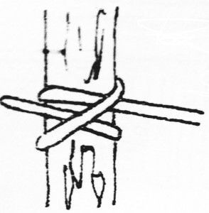

[Video Ballestrinque](https://www.youtube.com/watch?v=qf8aQH8HRCk)

## Nudo rizo o plano

### Para que sirve

Sirve para unir dos cuerdas, tambien se usa en primeros auxilios ya que al ser un nudo plano que no causa molestias.

### Como se hace

1. Se realiza haciendo un nudo simple de izquierda a derecha y luego otro nudo simple de derecha a izquierda.

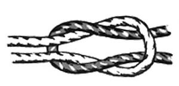

[Nudo rizo o plano](https://www.youtube.com/watch?v=ggJlaZa6mHc)

## Nudo de evasion o Fugitivo

### Para que sirve

Es un nudo de fijación que sirve para poder hacer un descenso y recuperar la cuerda desde abajo. 

### Como se hace

**Versión 1:**
1. Se divide la cuerda en dos partes iguales
2. Se realiza un seno con un nudo simple
3. Con uno de los chicotes se rodea el árbol y se lo introduce dentro del seno
4. Se realiza el descenso por la parte de la cuerda que se introdujo por el seno mientras que por la otra línea se recupera la la cuerda. Se utiliza sobre superficies lisas.

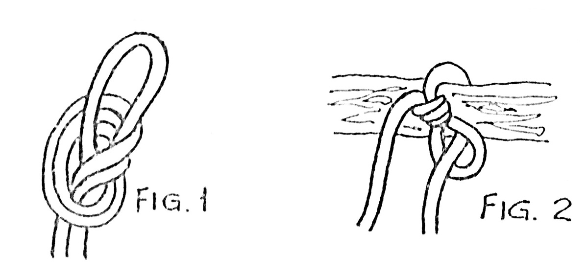

**Versión 1:**
1. Se divide la cuerda en dos partes iguales creando un seno que rodeara el árbol
2. Con una parte de la cuerda se crea un segundo seno que se introduce por el anterior de abajo hacia arriba
3. Con la otra cuerda se realiza un tercer seno que se introduce por el segundo seno y se ajusta
4. La cuerda donde se hizo el segundo seno es la que se utiliza para descender mientras que la otra línea recupera la cuerda. Recomendado para utilizar sobre superficies rugosas como un tronco.

 

