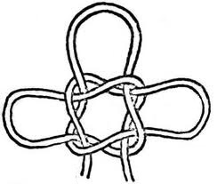
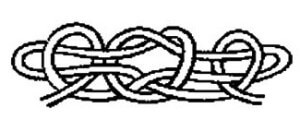
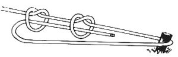
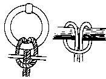
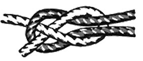
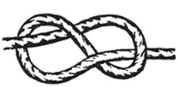

# Nudos

## Nudo de trebol

### Para que sirve

Se utiliza para afirmar un mástil mediante tres vientos,  para elevar plataformas cuadras y bultos de la misma forma

### Como se hace

1. Se hace un nudo simple sin ajustar
2. Se hace un seno hacia arriba y luego otro nudo simple entrelazado con el anterior
3. Se toman los extremos inferiores de los nudos simples y se hala hacia afuera ajustando

 

[Video_nudo_trebol]()

## Nudo de trebol

### Para que sirve

Su utilidad es similar a la del as de guia doble pero con la ventaja del tiempo y facilidad de ejecución,  se utiliza tambien en salvataje y transporte de carga.

### Como se hace

1. Se realizan dos gazas entrelazadas como si fuera un ballestrinque
2. Tomar la parte central entrelazada de las gazas y halar hacia los lados de forma inversa para crear dos senos
3. Hacer una gaza a cada uno de los costados, introducir los senos por la gaza y ajustar

 

[Video_nudo_trebol](https://www.youtube.com/watch?time_continue=1&v=uCFruu956TA)

## Nudo tensor

### Para que sirve

Nudo de fijación que sirve para tensar una cuerda y tiene como ventaja su facilidad para volver a ajustar en caso de ser necesario.

### Como se hace

1. Se hacen dos nudos sobre el firme a una separación de dos centímetros sin ajustarlos
2. Con el chicote se da una vuelta sobre el tronco o base
3. Se inserta el chicote sobre los dos nudos realizados anteriormente en el firme de manera que se regrese hacia el tronco
4. Se hala desde el chicote haciendo que se tense la cuerda y cada vez que necesite ser tensada de nuevo solo se vuelve a ajustar desde el chicote

 

[Video_nudo_trebol](https://www.youtube.com/watch?v=Sang_kRsAco)

## Presilla de alondra o boca de lobo

### Para que sirve

El nudo Presilla de Alondra es muy útil para sujetar un tronco a una cuerda de forma temporal, siempre y cuando se consiga una fuerte presión sobre él, también puede ser utilizado para atar la soga a un gancho o a una argolla.

### Como se hace

1. Se pasa el chicote abrazando el tronco o la argolla
2. Se cruza el chicote sobre el firme
3. Se regresa el chicote por la gaza formada anteriormente

 

[Video_nudo_trebol](https://www.youtube.com/watch?v=R3N38kEYOx0)

## Vuelta de escota

### Para que sirve

Es uno de los nudos de unión de gran utilidad, muy similar a un nudo de rizo con la diferencia que este sirve para unir cabos de distintos anchos (diferente mena). Este nudo también puede mejorarse haciéndose pasar dos vueltas sobre el bucle en lugar de una, justo antes de morder el chicote. A esta modificación se le llama “doble vuelta de escota”. Así logramos aumentar la seguridad del nudo cuando esté sometido a fuerzas durante largos periodos de tiempo.

### Como se hace

1. Con el seno de uno de los cabos se forma un bucle a modo de gaza.
2. Se pasa el chicote del otro cabo por dentro de la gaza, se le da vuelta y se pasa el chicote por debajo del firme para que quede mordido o aplastado por él.

 

[Video_nudo_trebol]()

## Nudo de ocho

### Para que sirve

Nudo de tope o peso, se utiliza para evitar que los cabos se salgan de las poleas, como finalización de cuerda e incluso para improvisar escaleras. Tiene una gran ventaja sobre el medio nudo, y es que, aunque sufra tensión, se afloja con facilidad.

### Como se hace

1. Se hace una gaza
2. Se monta el chicote por encima del firme
3. Luego se introduce el chicote por la parte de abajo de la gaza

 

[Ocho Simple](https://www.youtube.com/watch?v=lUBsyGRf4pM)

##  As de guía doble

### Para que sirve

El **as de guía doble** es un nudo muy utilizado en tareas de rescate marítimo. Se trata de un nudo muy seguro el cual proporciona dos lazos que tienen el mismo diámetro, los cuales pueden utilizarse de forma independiente y no se deshacen.En el caso de un rescate marítimo, el as de guía doble permite a la persona que se tiene que rescatar que pueda colocar una gaza a través de cada pierna y que pueda sujetarse al firme, facilitando de esta forma el rescate.

### Como se hace

1. Haremos una primera gaza que quede hacia adentro dejando aproximadamente dos metros de cuerda del lado del chicote.
2. El chicote pasará de abajo hacia arriba por la gaza.
3. El chicote dará la vuelta por el firme de la cuerda.
4. Regresar la cuerda por la misma gaza pasando el chicote de arriba hacia abajo.
5. Con el sobrante de cuerda del chicote dar una vuelta mas y seguir el nudo sobre la gaza anterior.
6. Si este nudo se hace en la cintura, debe quedar a la altura de la cadera y a unos 4 dedos de separación del cuerpo.

 

[Ocho Simple]()

