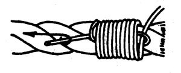

# Remate de cuerdas

### Para que sirve

Este nudo sirve para evitar que la cuerda se deshilache o se comience a desbaratar por los extremos por lo que se ajusta para asegurarla, podemos usar este nudo tambien con una cuerda sobre maderos como una variación del amarre redondo.

### Como se hace

1. Utilizando una cuerda delgada, ponerla sobre la cuerda mas gruesa haciendo un seno
2. Comenzamos a enrollar la cuerda fina sobre la gruesa de forma apretada hasta cubrir el área deseada
3. Luego se pasa el chicote de la cuerda mas fina por el seno que hicimos inicialmente
4. Ajustar el seno halando la cuerda mas fina desde el chicote de la parte inferior

[Video remate de cuerdas](https://www.youtube.com/watch?v=xkAFlA7Bvbc)
