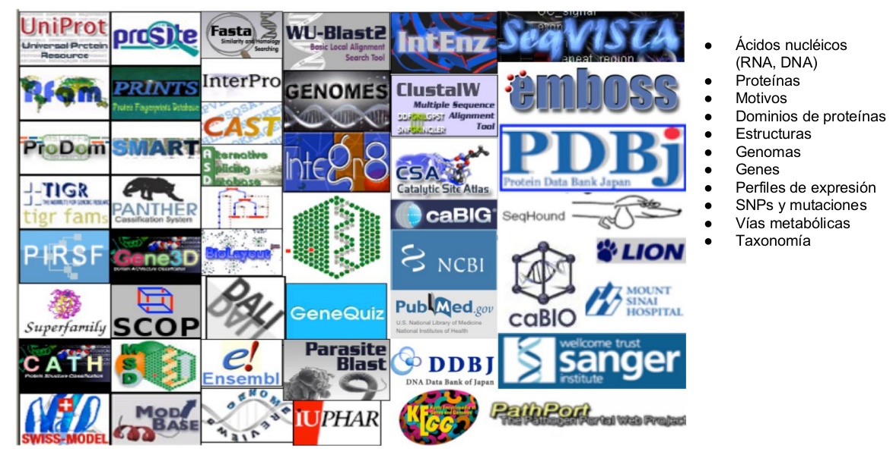
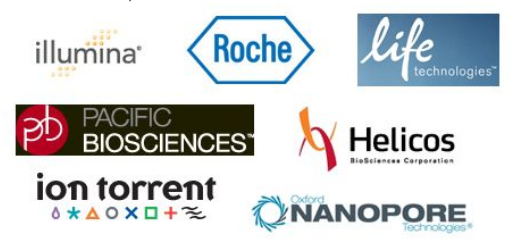
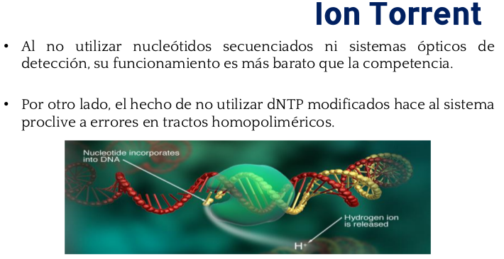
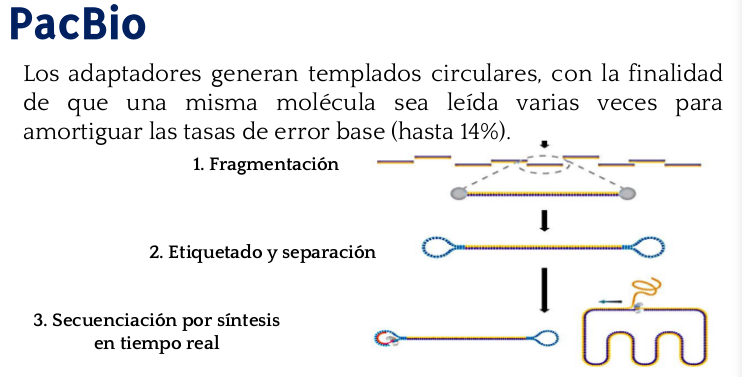
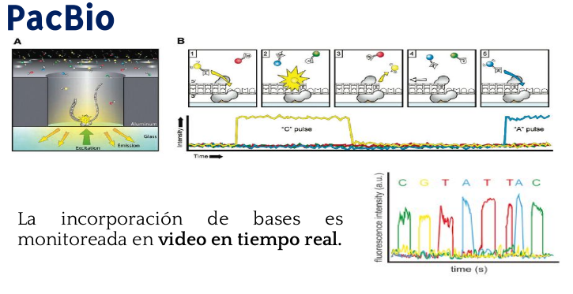

name: inverse
layout: true
class: center, middle, inverse
---
template: inverse
name: title

### Genommiting 2016. RNAseq Workflow

### [fmunoz@lcg.unam.mx](mailto:fmunoz@lcg.unam.mx)

.footnote[Descargar Presentación http://pipemg.github.io/slides/genomemeeting.html]
---
name: abstract
layout: false

.left-column[
## Temas 

]
.right-column[
 
### 0. Introducción a Linux
### 1. Introduccion a R
### 2. Bases de Datos 
### 3. Introducción a Bioconductor
### 4. Introducción a NGS
### 5. Workflow General del Análisis
### 6. Anotación Funcional

]
---
template:inverse

# Introducción a linux

---

.left-column[

### Introducción a linux

]
.right-column[
  <big><big>

- ¿Que es Linux?

- Caracteristicas

- Distribuciones

- Estructura de Directorios

- Maquina virtual

- Bases de Shell

- Comandos Básicos de Linux

</big></big>

]

---
template:inverse

# Introducción a R
---
.left-column[

### Introducción a R

]
.right-column[
  <big><big>

- Introduccion a R

- R Studio

- Como funciona R

- Manejo de Objetos en R

- Factores

- Graficos

- Exportación e Importación de Datos

- Manipulación de datos

</big></big>
]
---
template:inverse

# Bases de Datos de Información Genómica
---

.left-column[
### Bases de Datos de Información Genómica

]
.right-column[

  
### "Big Data" y Bioinformatica

Concepto que hace referencia al almacenamiento de **grandes
cantidades de datos Genómicos** provenientes de tecnologías de
secuenciación **NGS** y a los procedimientos usados para encontrar
patrones repetitivos dentro de esos datos.

#### Tipos de datos 

- Secuencias de nucleotidos
- Secuencias de proteinas
- Genomicas
- Patrones de secuencias
- Estructuras de DNA, RNA, Proteina
- ...

]

---
.left-column[
### Bases de Datos de Información Genómica

]
.right-column[

  
### Distribución y manejo de datos

#### Retos existentes

- **Heterogenidad de los datos**
 (Nt, proteinas, Interactoma,...)

- **Diferentes tecnologias** para obtener datos (NGS, Microarrays, MS, ...)

- **Formatos** para organizar (Fasta, fastq, gff, pdb,...)

- **Volumen** de información (TB+)

- **Redundancia** de información

- **Errores** heradados

- **Anotaciones** "inconsistentes"

]

---
.left-column[
### Bases de Datos de Información Genómica

]
.right-column[

  

#### Modelos de Bases de datos

- Relacional

- Jerárquico

- Redes

- Objetos

- ...

]

---

### Bases de Datos de Información Genómica

---

### Propositos de las bases de datos
.pull-left[
#### Repositorios
 - NCBI
 - EMBL-EBI
 - RefSeq

#### Proyectos
 - ENCODE
 - 1000 Genomes
 - HapMap

]
.pull-right[

#### Especializados
 - PDB (3D proteins)
 - Pfam
 - TargetScan
 - dbGaP
 - ArrayExpress

#### Específicos para Especie y taxa
 - Rat Genome DB
 - FlyBase
 - Wormbase
 - TAIR (arabidopsis)
 - E.coliHub, E.coli DB
]

---
template:inverse

# Introducción a Bioconductor
---

.left-column[

### Introducción a Bioconductor

]
.right-column[
  <big><big>

- ¿Que es un paquete de R?

- ¿Que es Bioconductor?

- Presentación de Bioconductor

- Workflows de Bioconductor

- DESeq2 (Alejandro Reyes)

- Vignette

</big></big>
]
 
---
template:inverse

# Introducción a NGS
---

.left-column[

### Introducción a NGS

]
.right-column[
  <big><big>

- Fundamentos de Secuenciación

- Tecnologías NGS

- RNA-seq

</big></big>
]
 
---

.left-column[

### Introducción a NGS

]
.right-column[
  
### Fundamentos de Secuenciación 

<big> 
- Watson & Crick, complementariedad de bases
    

- Generación 0 de secuenciadores (Evolucion, proteinas)

    
- Fundamentos de secuenciación
</big>

]
 
---

#### Generalidades

 
  

 - DNA pol
 - Lee y copia la información del genoma
 - Secuencia complementaria
 - proofreading

 - RNA pol.
 - Informacion del DNA a RNA

 - Ribosoma
 - Lee RNA y lo pasa a polipeptidos
 

 

---

.left-column[

### Introducción a NGS

]
.right-column[
    
### Secuenciadores de primera Generación

 

#### - Secuenciación por degradación (Maxam & Gilbert)

#### - Secuenciación por sintesis parcial (Sanger)

]
 
---

 

.left-column[

### Secuencion por Sanger

]
.right-column[
  
1. Desfragmentación del DNA

  

2. Amplificación utilizando dNTPs y ddNTPs

  
3. Purificación (remover dNTPs y ddNTPs)

  

4. Electroforesis
]

---

.left-column[

### Introducción a NGS

]
.right-column[
  
#### Secuencion por Sanger

]
 

---

.left-column[

### Tecnologías NGS

]
.right-column[
  
Unas cuantas empresas iniciaron la carrera tecnológica
NGS, ofreciendo plataformas diferentes, químicas diferentes,
archivos de salida diferentes, etc...

]
 

---

.left-column[

### Illumina

]
.right-column[
  
#### Proceso General

1. Fragmentación de la muestra

2. Etiquetado y separación de fragmentos

3. Amplificación clonal

4. Interrogación ciclica de bases

]
 

---
   

---

   

---

   

---

   

---

   

---

   

---

   

---

   

---

   

---

   

---

   

---

   

---

template:inverse

# Workflow General para análisis diferencial
---

   

---

name: last-page
template: inverse

## That's all folks (for now)!
### [fmunoz@lcg.unam.mx](mailto:fmunoz@lcg.unam.mx)

.footnote[Descargar Presentación http://pipemg.github.io/slides/Bernet_1999.html]

